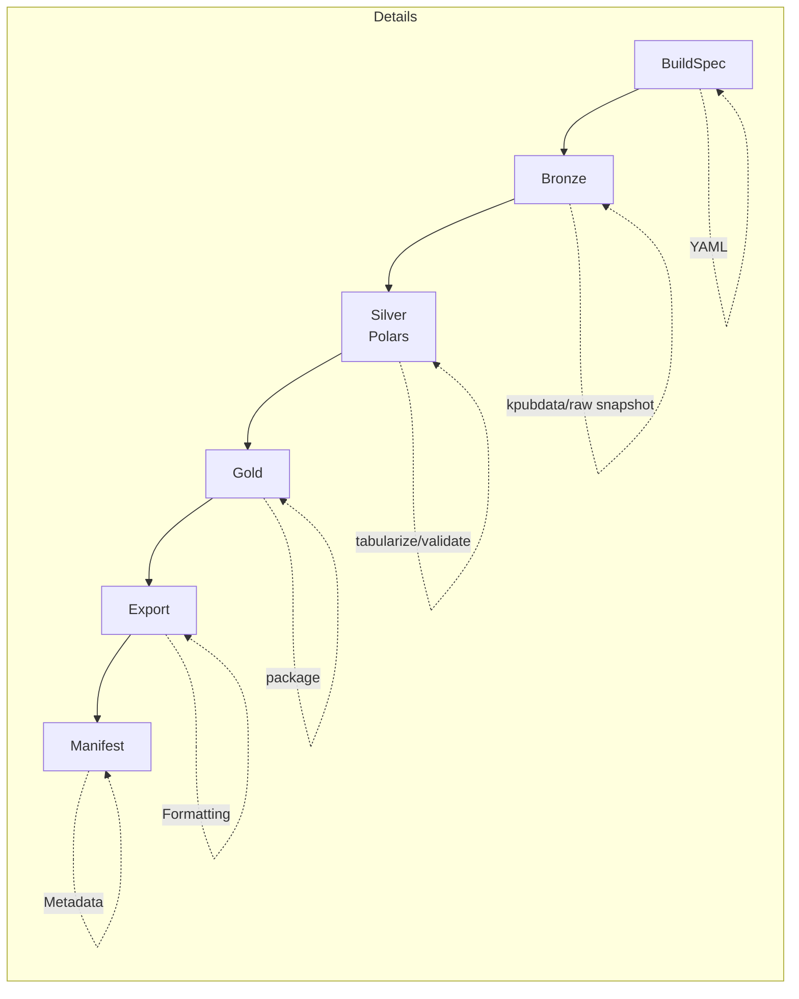
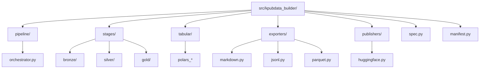
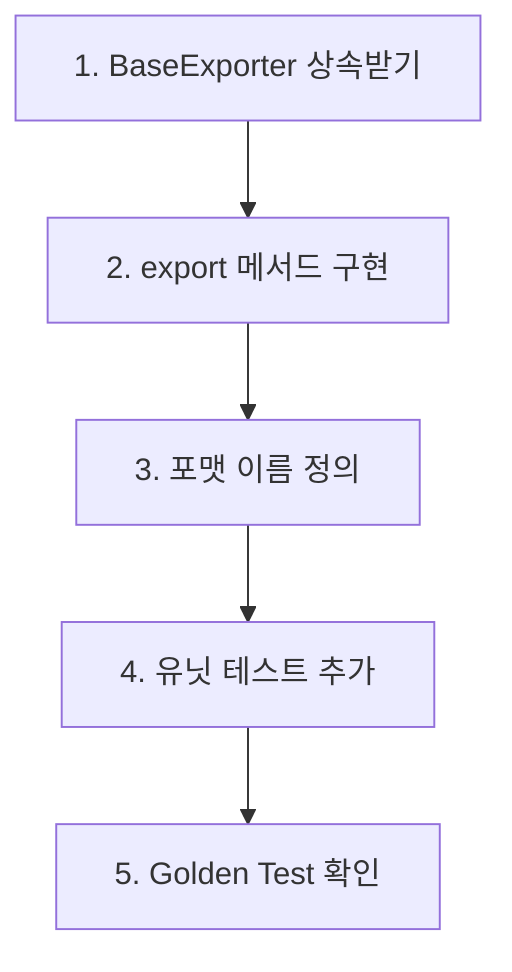

# AGENTS.md — kpubdata-builder

## 미션

`kpubdata` 위에서 동작하는 오케스트레이션 및 산출물 파이프라인 계층으로 KPubData Builder를 구현한다.

## 기본 규칙

- `kpubdata`의 provider 로직을 중복 구현하지 말 것
- 빌드 스펙은 선언적으로 유지할 것
- 마법 같은 동작보다 결정적 동작을 우선할 것
- exporter는 플러그형으로 유지할 것
- 모든 빌드는 반드시 manifest를 생성할 것
- 검증은 빠르고 명확하게 실패해야 할 것

## 언어 정책

- **Documentation**: 기본적으로 한국어로 작성한다. 영어 확장은 향후 릴리스에서 계획한다.
- **Code**: 코드(변수명, 함수명, 주석, docstring)는 한국어 우선으로 작성한다.
- **Commit messages**: 항상 영어로 작성한다.
- **Issue / PR titles and descriptions**: 한국어를 사용해도 되고, 영어도 가능하다.

## 브랜치 규칙

- 기본 브랜치는 `main`이다. **절대 `main`에 직접 push하지 말 것.**
- 항상 기능 브랜치에서 작업하고 PR을 열 것.
- 브랜치 이름 규칙: `feat/issue-<number>-<short-description>`, `fix/issue-<number>-<short-description>`, `docs/<short-description>`
- `main`에 force-push하지 말고, `main`을 삭제하지 말 것.
- 자신이 만들지 않은 브랜치를 이름 변경하거나 삭제하지 말 것.
- 어떤 git 작업이든 확신이 없으면 **추측하지 말고 먼저 물어볼 것.**

## 우선순위

1. spec models
2. Medallion pipeline orchestration
3. source execution using `kpubdata`
4. Polars tabular engine and Silver validation
5. artifact model and Gold packaging
6. markdown exporter
7. huggingface layout exporter
8. stage-aware publish hooks

## 테스트 기대사항

- spec 검증용 unit test
- Bronze/Silver/Gold 승격을 위한 stage-aware test
- Markdown 출력용 golden test
- manifest contract test
- fixture 기반 source execution test

---

## 이 프로젝트 이해하기

KPubData Builder는 `kpubdata` 사서가 가져온 원시 데이터를 사용자가 읽기 좋은 **책(보고서)이나 데이터셋 묶음으로 만들어주는 출판사**와 같습니다. 데이터를 수집하고, 검증하고, 원하는 형식으로 예쁘게 포장하는 과정을 담당합니다.

### 핵심 개념 용어 사전

| 용어 | 설명 |
| :--- | :--- |
| **BuildSpec** | 어떤 데이터를 어떻게 수집해서 어디로 보낼지 적힌 기획서 |
| **Bronze** | 원시 fetch 결과와 source snapshot을 보관하는 첫 단계 |
| **Silver** | Polars로 tabularize·검증·통계·preview를 만드는 중간 단계 |
| **Gold** | split-ready/export-ready 패키지를 조립하는 최종 내부 단계 |
| **Artifact** | 빌드 과정을 통해 만들어진 최종 결과물 (파일 등) |
| **Manifest** | 빌드 결과물에 대한 상세 명세서 (버전, 생성일 등) |
| **Polars** | Silver 단계의 표 처리와 검증에 사용하는 단일 tabular engine |
| **Exporter** | 데이터를 특정 형식(Markdown, JSON, HuggingFace 등)으로 변환하는 도구 |
| **Publisher** | 완성된 결과물을 특정 장소(GitHub, HF Hub 등)에 올리는 도구 |
| **Golden Test** | 이전의 '완벽한 결과물'과 현재 결과물을 비교하여 변경 사항을 확인하는 테스트 |

### 이 프로젝트의 코드가 실행되는 흐름 (Pipeline)



```text
[BuildSpec] -> [Bronze (raw fetch)] -> [Silver (Polars tabularize/validate)] -> [Gold (package)] -> [Export (Formatting)] -> [Manifest (Metadata)]
```

## AI 에이전트 코딩 가이드

### 좋은 프롬프트 예시
- "새로운 `CSVExporter`를 추가해줘. `exporters/base.py`를 참고해서 `ExportModel`을 구현해."
- "`BuildSpec` 모델에 데이터 필터링 조건을 추가하는 기능을 넣어줘."

### 에이전트 금지 사항
- **kpubdata 로직 중복 금지**: 데이터 파싱 로직은 `kpubdata`에 있어야 합니다. 여기서는 가져온 데이터를 다루기만 하세요.
- **불명확한 경로 사용 금지**: 파일 생성 경로는 항상 명확하게 정의되어야 합니다.
- **매니페스트 누락 금지**: 모든 빌드 결과물은 반드시 `manifest.json`을 포함해야 합니다.

### 에이전트 결과물 검증 체크리스트
- [ ] `uv run ruff check .`를 통과했는가?
- [ ] Bronze/Silver/Gold stage 책임을 문서/구현에서 혼동하지 않았는가?
- [ ] 새로운 Exporter에 대한 유닛 테스트를 작성했는가?
- [ ] stage-aware 테스트 또는 fixture가 필요한 변경이면 함께 추가했는가?
- [ ] Golden Test를 통해 출력 결과물이 의도대로 나오는지 확인했는가?

## 파일 구조 가이드



```text
src/kpubdata_builder/
├── pipeline/        # Medallion stage 흐름 제어
├── stages/          # bronze/silver/gold 구현
├── tabular/         # Polars 기반 표 처리
├── exporters/       # 데이터 형식 변환 (Markdown, JSONL 등)
├── publishers/      # 결과물 업로드 (HF, GitHub 등)
├── spec.py          # 빌드 기획서(BuildSpec) 정의
└── manifest.py      # 빌드 명세서 생성 로직
```

### 이 파일을 수정해야 할 때
- **데이터를 새로운 파일 형식으로 저장하고 싶을 때**: `exporters/`에 새 파일을 만듭니다.
- **결과물을 다른 곳에 자동으로 올리고 싶을 때**: `publishers/`에 새 로직을 추가합니다.
- **빌드 과정의 stage 승격 규칙을 바꾸고 싶을 때**: `pipeline/`와 `stages/`를 함께 검토합니다.

## Exporter 추가 가이드

### Exporter 개발 단계



1. `exporters/base.py`의 `BaseExporter` 클래스를 상속받습니다.
2. `export(self, artifacts: List[Artifact]) -> List[Path]` 메서드를 구현합니다.
3. 지원하는 포맷 이름을 클래스 변수로 정의합니다.
4. `tests/unit/test_exporters.py`에 테스트를 추가합니다.

### Golden Test란?
빌드 결과물이 텍스트(예: Markdown)인 경우, 코드가 바뀌어도 결과물의 형식이 유지되는지 확인하기 위해 미리 저장해둔 '정답 파일'과 현재 결과를 1:1로 비교하는 테스트 방식입니다.

---

## 관련 문서

### 이 저장소 내 문서
| 문서 | 설명 |
| :--- | :--- |
| [CONTRIBUTING.md](./CONTRIBUTING.md) | 프로젝트 기여 가이드 |
| [ARCHITECTURE.md](./ARCHITECTURE.md) | 시스템 아키텍처 설계 |
| [DOMAIN_MODEL.md](./DOMAIN_MODEL.md) | 도메인 모델 정의 |
| [EXPORT_MODEL.md](./EXPORT_MODEL.md) | 데이터 변환 모델 |
| [API_CONTRACT.md](./API_CONTRACT.md) | API 인터페이스 규약 |
| [PRD.md](./PRD.md) | 제품 요구사항 정의서 |
| [ROADMAP.md](./ROADMAP.md) | 프로젝트 로드맵 |

### KPubData Product Family
| 저장소 | 문서 | 설명 |
| :--- | :--- | :--- |
| [kpubdata](https://github.com/yeongseon/kpubdata) | [AGENTS.md](https://github.com/yeongseon/kpubdata/blob/main/AGENTS.md) | 코어 에이전트 가이드 |
| [kpubdata-studio](https://github.com/yeongseon/kpubdata-studio) | [AGENTS.md](https://github.com/yeongseon/kpubdata-studio/blob/main/AGENTS.md) | 스튜디오 에이전트 가이드 |
