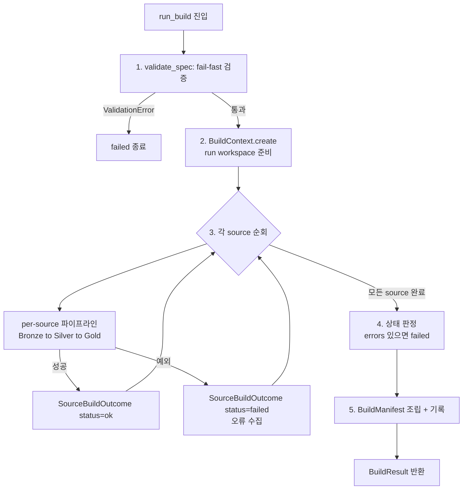
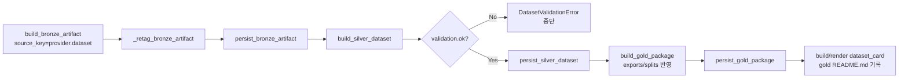

# Build Algorithm Specification — KPubData Builder

이 문서는 KPubData Builder의 **정식(canonical) 빌드 알고리즘**을 하나의 명세로 정리합니다. 지금까지 [ARCHITECTURE.md](./ARCHITECTURE.md)(단계 설계), [BUILD_STATE.md](./BUILD_STATE.md)(상태 머신), [BUILD_SPEC.md](./BUILD_SPEC.md)(검증 규칙)에 흩어져 있던 처리 순서·검증 게이트·상태 전이·부분 실패 정책을 실행 흐름 관점에서 통합합니다.

기준 구현은 `kpubdata_builder.pipeline.run_build`이며, 이 문서는 그 구현을 서술한 것입니다. 코드와 문서가 어긋나면 **코드가 정답**입니다.

## 1. 범위와 진입점

- **정식 경로(이 문서의 대상)**: `kpubdata_builder.pipeline.orchestrator.run_build`. Service·CLI가 사용하는 Medallion 파이프라인이며 모든 신규 작업의 기준입니다.
- **레거시 경로(대상 아님, DEPRECATED)**: `scripts/publish_to_hf.py` 계열. 별도 설정 스키마를 사용하는 구형 흐름으로, 자세한 구분은 [ARCHITECTURE.md §9](./ARCHITECTURE.md#9-vs-208)를 참고하세요.

진입점 시그니처:

```python
def run_build(
    spec: BuildSpec,
    *,
    client: SourceClient,
    output_root: Path,
    run_id: str | None = None,
) -> BuildResult: ...
```

## 2. 전체 알고리즘 개요



의사코드:

```text
run_build(spec, client, output_root, run_id):
    validate_spec(spec)                      # (1) 실패 시 즉시 ValidationError
    context = BuildContext.create(spec, output_root, run_id)
    outcomes, errors = [], []
    row_counts, schema_summaries, provenance = {}, {}, []

    for source in spec.sources:              # (3) source 단위 순회
        try:
            outcome = _run_source_pipeline(context, client, source)
            outcomes.append(outcome)         # status="ok"
        except BuildError as e:
            outcomes.append(failed_outcome(source, e))
            errors.append(client_safe_message(e))

    status = "ok" if not errors else "failed"   # (4) 부분 실패 = 전체 failed
    manifest = BuildManifest(...)                # (5) 항상 생성
    manifest_writer(manifest, output_root/run_id/"manifest.json")
    return BuildResult(context, status, outcomes, manifest_path)
```

## 3. 단계별 상세

### 3.1 Spec 검증 (fail-fast 게이트, #212)

`run_build`는 어떤 실행 자원도 만들기 전에 `validate_spec(spec)`을 먼저 호출합니다. 하나라도 위반하면 문제 목록을 모아 `ValidationError`로 **즉시 중단**합니다. 검증 규칙 요약:

| 대상 | 규칙 |
| :--- | :--- |
| `dataset_id` / `title` / `description` | 공백이 아닌 문자열이어야 함 |
| `sources` | 최소 1개 이상 |
| `sources[i].provider` / `.dataset` | 공백이 아닌 문자열 (뒤늦은 fetch 실패 차단, #191) |
| `sources[i].alias` | 제공되었다면 공백만으로 구성 금지 |
| `exports` | 최소 1개 이상 |
| `exports[i].output_path` | 공백이 아닌 문자열 |
| `exports[i].kind` | `EXPORTER_REGISTRY`에 등록된 종류여야 함 |
| `metadata` 키 | 공백이 아닌 문자열 |
| `splits` (ratio) | 이름 비공백, 값은 유한수(#192)·양수, 합계 1.0 (±1e-6) |
| `splits` (key) | `key`가 비공백 컬럼명이어야 함 |

> 설계 원칙: **검증은 빠르고 명확하게 실패해야 한다.** 검증은 조언이 아니라 실행을 막는 게이트입니다.

### 3.2 실행 컨텍스트 준비

`BuildContext.create(spec, output_root=..., run_id=...)`가 실행 식별자(run_id)와 run workspace를 확정합니다. 중간 산출물은 단계별로 분리됩니다.

```text
build/{run_id}/
├── bronze/
├── silver/
├── gold/
└── manifest.json
```

### 3.3 Source 단위 파이프라인 (`_run_source_pipeline`)

각 source에 대해 Bronze → Silver → Gold를 순서대로 수행합니다.



1. **Bronze — 원시 수집/스냅샷**
   - `build_bronze_artifact(client, source_key=f"{provider}.{dataset}", fetch_params=...)`로 `kpubdata`를 통해 원시 데이터를 가져옵니다.
   - `_retag_bronze_artifact`로 소스 키를 정렬한 뒤 `persist_bronze_artifact`로 snapshot·provenance를 기록합니다.
   - 실제 수집·정규화 로직은 `kpubdata`가 소유하며 Builder는 이를 중복 구현하지 않습니다.

2. **Silver — 표 변환 + 검증 게이트 (#189/#261)**
   - `build_silver_dataset(bronze)`가 Polars 단일 엔진으로 tabularize하고, 통계·preview·`validation` 결과를 산출합니다.
   - **게이트**: `silver.validation.ok`가 아니면 `DatasetValidationError`로 즉시 중단합니다. 검증은 필수 컬럼 존재(`missing_column`)와 선언된 dtype 일치(`dtype_mismatch`)를 구조화된 `ValidationProblem`으로 검사합니다(`validate_table`).
   - 통과 시 `persist_silver_dataset`로 기록합니다.

3. **Gold — 패키징**
   - `build_gold_package(silver, dataset_name, exports=context.spec.exports, splits_spec=context.spec.splits)`로 split-ready/export-ready 패키지를 조립합니다.
   - `persist_gold_package` 후 `build_dataset_card`/`render_dataset_card`로 dataset card를 만들어 gold `README.md`로 기록합니다.

각 source의 `row_counts`와 `schema_summaries`는 이후 manifest에 반영하기 위해 소스 키별로 누적됩니다. 성공한 source는 `SourceBuildOutcome(source_key, status="ok", stages_completed=..., error=None)`으로 기록됩니다.

> **Export 단계 참고**: 현재 export는 gold 패키지를 통해 이뤄지며, stage-aware exporter의 완전한 연결은 향후(#28/v0.2)로 연기되어 있습니다.

### 3.4 오류 처리 및 상태 판정

- source 파이프라인에서 발생한 예외는 잡아서 `SourceBuildOutcome(status="failed", error=...)`으로 변환합니다.
- `ValidationError`/`DatasetValidationError` 메시지는 그대로 전달하고, 그 외 `BuildError`는 서버 측에 상세 로그를 남기되 클라이언트에는 일반화된 메시지를 전달합니다(#225).
- 최종 상태: `status = "ok" if not errors else "failed"`. **어느 source든 하나라도 실패하면 전체 빌드가 `failed`입니다.**

### 3.5 Manifest 조립 (필수)

성공/실패와 무관하게 항상 `BuildManifest`를 만들어 `output_root/{run_id}/manifest.json`에 기록합니다. 주요 필드(`manifest/models.py`, `MANIFEST_SCHEMA_VERSION = "1.0.0"`):

| 필드 | 의미 |
| :--- | :--- |
| `build_id` | 실행 식별자 |
| `started_at` / `finished_at` | 실행 시작·종료 시각 |
| `schema_version` | 매니페스트 형식 버전(semver, #211) |
| `inputs` / `outputs` | 입력 소스 식별자 / 생성 결과물 경로 |
| `warnings` / `errors` | 경고 / 실패·부분 실패 메시지 |
| `row_counts` | 소스(산출물) 키별 레코드 수 |
| `schema_summaries` | 키별 스키마 요약(`row_counts`와 동일 키) |
| `provenance` | 소스별 fetch 시각/파라미터/레코드 수/체크섬 |
| `build_environment` | Python/kpubdata/builder 버전 (`capture_build_environment()`) |
| `inputs_fingerprint` | 입력 전체 재현성 지문 `sha256:...` (입력 없으면 None) |

> 설계 원칙: **모든 빌드는 반드시 manifest를 생성한다.** manifest는 artifact 생성 직후·publish 이전에 기록해 감사 가능성을 보장합니다([BUILD_STATE.md §7](./BUILD_STATE.md#7-manifest)).

## 4. 상태 머신과의 대응

`run_build`의 실행 흐름은 [BUILD_STATE.md](./BUILD_STATE.md)의 상태 머신과 다음과 같이 대응합니다.

`draft → validated → running → exported → manifested → published`

| 알고리즘 단계 | 대응 상태 | 실패 시 |
| :--- | :--- | :--- |
| `validate_spec` (§3.1) | `draft → validated` | spec invalid → `failed` |
| source 파이프라인 실행 (§3.3) | `validated → running` | source/실행 오류 → `failed` |
| Gold/artifact 기록 (§3.3) | `running → exported` | — |
| manifest 기록 (§3.5) | `exported → manifested` | manifest 기록 실패 → `failed` |
| publish (요청 시) | `manifested → published` | publish 실패 → `failed` |

## 5. 부분 실패 및 재시도 정책

핵심 정책([BUILD_STATE.md §5](./BUILD_STATE.md#5-partial-success), [§6](./BUILD_STATE.md#6-retry)):

1. **source 일부 성공을 전체 성공으로 간주하지 않습니다.** 필수 source 중 하나라도 실패하면 빌드는 `failed`입니다.
2. export까지 성공하고 publish만 실패한 경우, artifact는 남을 수 있으나 run은 `failed`로 기록하고 manifest에 artifact 존재와 publish 실패를 함께 남깁니다.
3. 재시도 원칙:
   - `draft`/`validated` 이전 오류는 같은 run을 복구하기보다 **새 run 생성**이 명확합니다.
   - `manifested` 이후 publish 실패는 **publish만 별도 재시도**할 수 있습니다.

## 6. 반환값

`BuildResult(context, status, outcomes, manifest_path)`

- `context`: 실행 컨텍스트(run_id, workspace 등).
- `status`: `"ok"` 또는 `"failed"`.
- `outcomes`: source별 `SourceBuildOutcome(source_key, status, stages_completed, error)` 목록.
- `manifest_path`: 기록된 `manifest.json` 경로.

## 7. 관련 문서

| 문서 | 설명 |
| :--- | :--- |
| [ARCHITECTURE.md](./ARCHITECTURE.md) | Medallion 단계 설계와 계층 분리 |
| [BUILD_STATE.md](./BUILD_STATE.md) | 빌드 실행 상태 머신 |
| [BUILD_SPEC.md](./BUILD_SPEC.md) | BuildSpec 계약과 검증 규칙 |
| [DOMAIN_MODEL.md](./DOMAIN_MODEL.md) | 도메인 엔터티(ER) 모델 |
| [EXPORT_MODEL.md](./EXPORT_MODEL.md) | 내보내기 모델 |
| [API_CONTRACT.md](./API_CONTRACT.md) | Builder API/Service 계약 |
