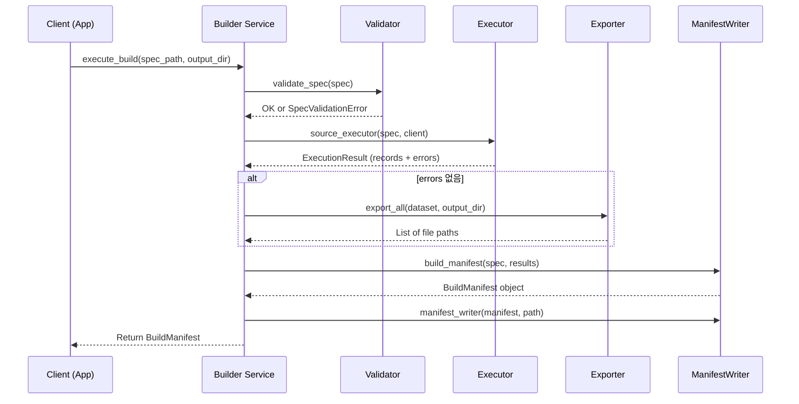
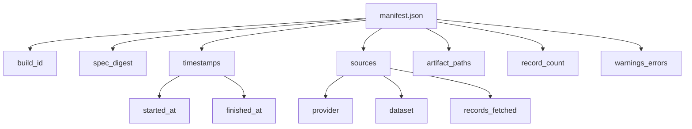

# API Contract — KPubData Builder

KPubData Builder는 터미널(CLI)과 파이썬 코드(Service-level API) 두 가지 방식으로 사용할 수 있습니다.

## 1. CLI Commands (명령줄 도구)

터미널에서 `kpubdata-builder` 명령어를 통해 실행할 수 있습니다.

```mermaid
flowchart TD
    V[validate] -- "Spec YAML" --> P[preview]
    P -- "Sample Data" --> B[build]
    B -- "Files + Manifest" --> PUB[publish]
    
    subgraph "Input / Output"
        V1[YAML File] -.-> V
        V -- "Result" -.-> V2[OK / Error Msg]
        P -- "Output" -.-> P2[Schema + 5 Rows]
        B -- "Output" -.-> B2[Artifacts + manifest.json]
        PUB -- "Output" -.-> PUB2[URL / Success]
    end
```

### 1.1 validate (검증)
작성한 빌드 기획서(BuildSpec YAML)에 문법 오류나 논리적 오류가 없는지 확인합니다.
- **사용 예시:** `kpubdata-builder validate spec.yaml`
- **옵션:** `--strict` (더 엄격한 규칙 적용)
- **출력:** "Success" 또는 상세 오류 메시지

### 1.2 preview (미리보기)
데이터를 아주 조금만 가져와서, 실제로 어떤 항목들이 들어있고 어떤 모양으로 파일이 만들어질지 살짝 보여줍니다.
- **사용 예시:** `kpubdata-builder preview spec.yaml`
- **출력:** 데이터 스키마(항목 이름들)와 처음 5건의 샘플 데이터

### 1.3 build (빌드 실행)
실제로 공공데이터를 모두 가져와서 파일을 만들고, 결과 보고서(Manifest)까지 생성합니다.
- **사용 예시:** `kpubdata-builder build spec.yaml --output-dir ./dist`
- **출력:** 생성된 파일 목록 및 `manifest.json`

### 1.4 publish (배포)
빌드가 완료된 파일들을 외부 저장소(Hugging Face 등)로 올립니다.
- **사용 예시:** `kpubdata-builder publish spec.yaml`

---

## 2. Service-level Operations (파이썬 코드 API)

다른 파이썬 프로그램에서 Builder의 기능을 가져와 쓰고 싶을 때 사용합니다.



### 2.1 validate_spec
- **시그니처:** `validate_spec(spec_path: str) -> ValidationResult`
- **파라미터:** `spec_path` (YAML 파일 경로)
- **반환값:** 오류 목록을 포함한 결과 객체

### 2.2 preview_build
- **시그니처:** `preview_build(spec_path: str) -> ArtifactDataset`
- **파라미터:** `spec_path` (YAML 파일 경로)
- **반환값:** 샘플 데이터가 들어있는 데이터셋 객체

### 2.3 execute_build
- **시그니처:** `execute_build(spec_path: str, output_dir: str) -> BuildManifest`
- **파라미터:** `spec_path` (기획서 경로), `output_dir` (저장할 폴더 경로)
- **반환값:** 빌드 실행 요약 정보가 담긴 Manifest 객체

### 2.4 publish_build
- **시그니처:** `publish_build(spec_path: str, target: Optional[str] = None) -> bool`
- **파라미터:** `target` (특정 배포처 이름)
- **반환값:** 배포 성공 여부 (True/False)

---

## 3. Manifest Contract (결과 명세서 예시)

빌드가 성공하면 항상 `manifest.json` 파일이 생성됩니다. 이 파일은 빌드가 제대로 되었는지 확인하는 영수증과 같습니다.



### 3.1 JSON Output 예시 (성공)
```json
{
  "build_id": "bld-20250401-abc1234",
  "status": "succeeded",
  "spec_digest": "sha256:d8e8f8...",
  "started_at": "2025-04-01T10:00:00Z",
  "finished_at": "2025-04-01T10:05:30Z",
  "sources": [
    {
      "provider": "datago",
      "dataset": "village_fcst",
      "status": "succeeded",
      "records_fetched": 1500
    }
  ],
  "artifact_paths": [
    "artifacts/weather_report.md",
    "artifacts/data.jsonl"
  ],
  "record_count": 1500,
  "warnings": [],
  "errors": []
}
```

### 3.2 핵심 필드 설명
- `build_id`: 이번 빌드에 부여된 고유 번호
- `spec_digest`: 어떤 기획서로 빌드했는지 식별하는 지문 (기획서가 바뀌면 이 값도 바뀝니다)
- `record_count`: 최종적으로 수집된 데이터의 총 개수
- `warnings`: 빌드 중에 발생한 사소한 문제들 (데이터 항목 누락 등)

### 3.3 빌드 실패 시 Manifest

빌드가 실패하더라도 `manifest.json`은 항상 생성됩니다. 실패 manifest는 감사 추적과 디버깅에 사용됩니다.

```json
{
  "build_id": "bld-20250401-abc1234",
  "status": "failed",
  "spec_digest": "sha256:d8e8f8...",
  "started_at": "2025-04-01T10:00:00Z",
  "finished_at": "2025-04-01T10:00:12Z",
  "sources": [
    {
      "provider": "datago",
      "dataset": "village_fcst",
      "status": "failed",
      "error": "TransportTimeoutError: Request timed out after 3 attempts"
    }
  ],
  "artifact_paths": [],
  "record_count": 0,
  "warnings": [],
  "errors": [
    "Source 'datago.village_fcst' fetch failed: Request timed out after 3 attempts"
  ]
}
```

### 3.4 부분 실패(Partial Failure) 시 Manifest

`sources`에 여러 provider를 넣었을 때, 일부 source만 실패하는 경우:

```json
{
  "build_id": "bld-20250401-def5678",
  "status": "failed",
  "spec_digest": "sha256:a1b2c3...",
  "started_at": "2025-04-01T10:00:00Z",
  "finished_at": "2025-04-01T10:01:30Z",
  "sources": [
    {
      "provider": "datago",
      "dataset": "village_fcst",
      "status": "succeeded",
      "records_fetched": 1500
    },
    {
      "provider": "datago",
      "dataset": "air_quality",
      "status": "failed",
      "error": "AuthError: Invalid API key"
    }
  ],
  "artifact_paths": [],
  "record_count": 0,
  "warnings": [],
  "errors": [
    "Source 'datago.air_quality' fetch failed: Invalid API key"
  ]
}
```

> **기본 정책**: source 하나라도 실패하면 build 전체가 실패합니다. 부분 성공 artifact는 생성하지 않습니다.

---

## 4. Error Contract (에러 응답 규약)

### 4.1 예외 계층

Builder의 모든 런타임 에러는 `BuildError` 하위 클래스로 표현됩니다.

```text
BuildError (base)
├── SpecLoadError          — YAML 파일 I/O 또는 파싱 실패
├── SpecValidationError    — 스펙 검증 실패 (여러 이슈 집계 가능)
├── SourceExecutionError   — source 데이터 fetch 실패
├── AssemblyError          — 데이터 조립 실패
├── ExportError            — 파일 생성/쓰기 실패
├── ManifestWriteError     — manifest 쓰기 실패
└── PublishError           — 외부 저장소 배포 실패
```

### 4.2 에러 발생 시나리오

| 단계 | 에러 타입 | 발생 원인 |
|:---|:---|:---|
| Spec 로딩 | `SpecLoadError` | YAML 파일 없음, 읽기 권한 없음, YAML 문법 오류 |
| Spec 검증 | `SpecValidationError` | dataset_id 비어 있음, sources 없음, alias 중복 등 |
| Source 실행 | `SourceExecutionError` | API 무응답, 인증 실패, 응답 파싱 실패 등 |
| 데이터 조립 | `AssemblyError` | source key 누락 |
| 내보내기 | `ExportError` | 디스크 공간 부족, 파일 쓰기 권한 없음 |
| Manifest 쓰기 | `ManifestWriteError` | 디스크 I/O 실패 |
| 배포 | `PublishError` | 네트워크/인증 실패, 원격 저장소 오류 |

### 4.3 validate_spec 에러 응답

검증 실패 시 첫 번째 오류에서 즉시 중단하지 않고, 모든 이슈를 모아 한 번에 보고합니다.

```python
try:
    validate_spec(spec)
except SpecValidationError as e:
    print(e.issues)
    # ("dataset_id must be a non-empty string",
    #  "source alias 'forecast' is duplicated",
    #  "export output_path is empty")
```

> 자세한 에러 처리 설계는 [docs/ERROR_HANDLING.md](./docs/ERROR_HANDLING.md)를 참조하세요.

---

## 관련 문서

### 이 저장소 내 문서
| 문서 | 설명 |
| :--- | :--- |
| [ARCHITECTURE.md](./ARCHITECTURE.md) | 시스템 아키텍처 설계 |
| [DOMAIN_MODEL.md](./DOMAIN_MODEL.md) | 도메인 모델 정의 |
| [EXPORT_MODEL.md](./EXPORT_MODEL.md) | 데이터 변환 모델 |
| [docs/ERROR_HANDLING.md](./docs/ERROR_HANDLING.md) | 에러 처리 설계 |

### KPubData Product Family
| 저장소 | 문서 | 설명 |
| :--- | :--- | :--- |
| [kpubdata](https://github.com/yeongseon/kpubdata) | [API_SPEC.md](https://github.com/yeongseon/kpubdata/blob/main/API_SPEC.md) | Core API 명세 |
| [kpubdata-studio](https://github.com/yeongseon/kpubdata-studio) | [API_CONTRACT.md](https://github.com/yeongseon/kpubdata-studio/blob/main/API_CONTRACT.md) | Studio 인터페이스 규약 |
