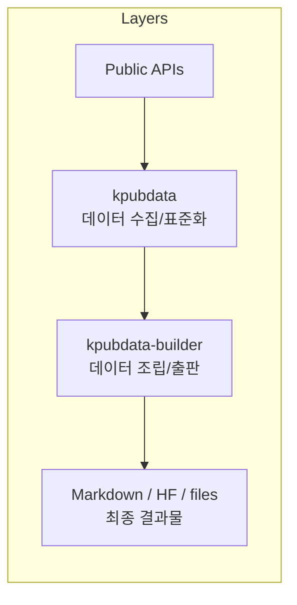
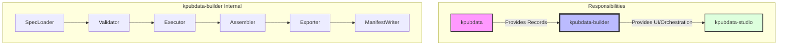
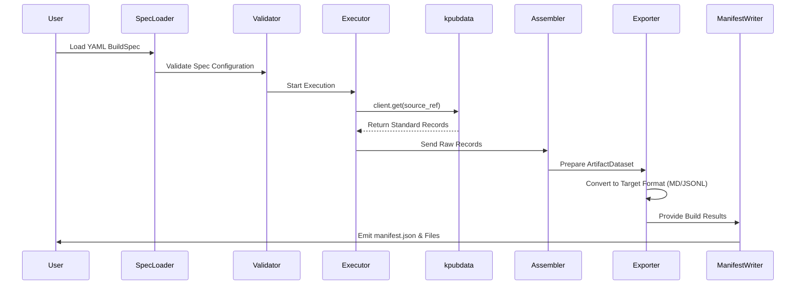
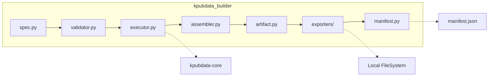
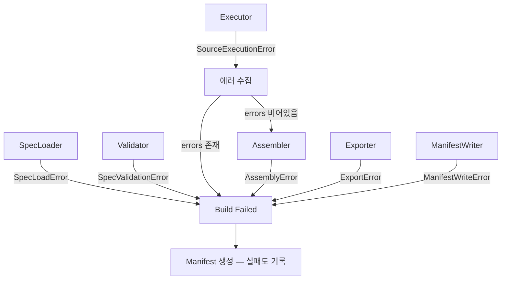

# Architecture — KPubData Builder

## 0. "Builder가 뭔가요?" (초보자용 설명)

KPubData Builder는 **"공공데이터 요리 주방"**과 같습니다.

*   **요리 레시피 (BuildSpec):** 어떤 재료(공공데이터)를 가져와서, 어떻게 손질(변환)하고, 어떤 그릇(파일 형식)에 담을지 적어둔 문서입니다.
*   **주방 (Builder):** 이 레시피를 읽고 실제로 데이터를 가져와서 요리를 완성해주는 시스템입니다.
*   **완성된 요리 (Artifact):** 사용자가 바로 먹을 수 있게(읽을 수 있게) 완성된 데이터셋이나 보고서입니다.

개발 경험이 없더라도, 레시피(YAML 파일)만 잘 작성하면 Builder가 복잡한 데이터 수집과 변환 과정을 대신 처리해줍니다.

## 1. Role

KPubData Builder sits between `kpubdata` and publication targets.



```text
Public APIs
  -> kpubdata (데이터 수집/표준화)
  -> kpubdata-builder (데이터 조립/출판)
  -> Markdown / HF / files (최종 결과물)
```

## 2. Architectural Principle

Builder is an orchestrator.



It should not:
- reimplement provider adapters (데이터 기관별 연결 로직은 `kpubdata`의 역할입니다)
- own public API access logic (API 호출 자체는 `kpubdata`가 담당합니다)
- become a general-purpose ETL framework (모든 종류의 데이터 처리가 아닌, 공공데이터 출판에 집중합니다)

It should:
- load a build spec
- fetch via `kpubdata`
- assemble records
- validate outputs
- export artifacts
- emit a manifest

## 3. Layers (상세 설명)

### 3.1 Spec Layer (기획 레이어)
- **하는 일:** 사용자가 작성한 빌드 기획서(BuildSpec)를 읽고, 오타가 없는지 혹은 실행 불가능한 설정은 없는지 검사합니다.
- **비유:** 요리사가 주문서를 읽고 재료가 다 있는지, 만들 수 있는 요리인지 확인하는 단계입니다.
- **핵심 파일:** `spec.py`, `validator.py`
- **수정해야 할 때:** 빌드 기획서에 새로운 설정 항목을 추가하고 싶을 때.

### 3.2 Execution Layer (수행 레이어)
- **하는 일:** `kpubdata`를 사용하여 실제로 공공데이터 API에 접속하고 데이터를 가져옵니다.
- **비유:** 시장에 가서 신선한 재료(데이터)를 사오는 단계입니다.
- **핵심 파일:** `executor.py`
- **수정해야 할 때:** 데이터를 가져오는 방식이나 병렬 처리 로직을 개선하고 싶을 때.

### 3.3 Assembly Layer (조립 레이어)
- **하는 일:** 여러 곳에서 가져온 데이터들을 하나로 묶고, 공통된 메타데이터를 부여하여 '최종 결과물 직전의 데이터 뭉치'를 만듭니다.
- **비유:** 사온 재료들을 씻고 다듬어서 요리 용기에 담기 좋게 준비하는 단계입니다.
- **핵심 파일:** `assembler.py`, `artifact.py`
- **수정해야 할 때:** 데이터를 합치는 규칙이나 통계 정보를 생성하는 로직을 바꿀 때.

### 3.4 Export Layer (출력 레이어)
- **하는 일:** 준비된 데이터 뭉치를 Markdown, JSONL, Parquet 등 실제 파일 형태로 변환합니다.
- **비유:** 준비된 요리를 예쁜 그릇에 담고 장식하는 단계입니다.
- **핵심 파일:** `exporters/` 디렉토리 내의 파일들
- **수정해야 할 때:** 새로운 파일 형식(예: CSV, Excel)으로 저장하고 싶을 때.

### 3.5 Publication Layer (배포 레이어)
- **하는 일:** 생성된 파일들을 Hugging Face Hub나 GitHub 등 외부 저장소로 업로드합니다.
- **비유:** 완성된 요리를 손님의 식탁으로 배달하거나 온라인 매장에 등록하는 단계입니다.
- **핵심 파일:** `publishers/` 디렉토리 내의 파일들
- **수정해야 할 때:** 새로운 외부 서비스로 자동 업로드를 하고 싶을 때.

## 4. Major Components & Data Flow (데이터 흐름)

데이터가 빌드 과정을 거쳐 결과물이 되는 흐름은 다음과 같습니다.





1.  **BuildSpec YAML:** 사용자가 기획서를 작성합니다.
2.  **Spec Loader:** `spec.py`의 모델을 사용하여 YAML을 파이썬 객체로 바꿉니다.
3.  **Validator:** `validator.py`가 기획서의 오류를 찾아냅니다.
4.  **Source Executor:** `executor.py`가 `kpubdata`를 호출하여 원시 데이터를 가져옵니다.
5.  **Assembler:** `assembler.py`가 가져온 데이터를 `ArtifactDataset`(`artifact.py`)으로 조립합니다.
6.  **Exporter(s):** `exporters/base.py`를 상속받은 개별 Exporter들이 물리적 파일을 생성합니다.
7.  **Manifest Writer:** `manifest.py`가 빌드 결과와 통계를 `manifest.json`으로 기록합니다.

## 5. Boundary with kpubdata (kpubdata와의 관계)

Builder는 `kpubdata`를 내부적으로 **"사용"**하는 프로젝트입니다.

### kpubdata responsibilities (재료 공급원)
- 개별 공공데이터 기관(기상청, 공공데이터포털 등)과의 통신
- 복잡한 XML/JSON 응답을 표준 형식으로 변환
- API 인증 키 관리

### kpubdata-builder responsibilities (요리사)
- 어떤 데이터를 조합할지 정의
- 수집된 데이터를 특정 목적(예: AI 학습용, 보고서용)에 맞게 포맷팅
- 빌드 결과에 대한 이력 관리(Manifest)

### 코드 연결점 예시
```python
# kpubdata-builder 내부의 executor.py 중 일부 (개념 예시)
from kpubdata import Client

def fetch_data(source_ref):
    client = Client()
    # kpubdata를 통해 데이터를 가져옴
    records = client.get(
        provider=source_ref.provider,
        dataset=source_ref.dataset,
        params=source_ref.params
    )
    return records
```

## 6. Boundary with Studio

Builder must expose stable machine interfaces that Studio can call:
- validate spec
- preview build
- execute build
- inspect manifest
- list exporters

## 7. Error Handling (에러 처리 아키텍처)

### 7.1 예외 계층

Builder는 자체 예외 계층(`BuildError`)을 가집니다. `kpubdata`의 `PublicDataError`는 Builder 예외의 `__cause__`로 보존되며, 사용자에게 직접 노출되지 않습니다.

```text
BuildError
├── SpecLoadError
├── SpecValidationError
├── SourceExecutionError
├── AssemblyError
├── ExportError
├── ManifestWriteError
└── PublishError
```

### 7.2 에러 전파 흐름



### 7.3 핵심 원칙

1. **Manifest 생성 시도** — 실패한 빌드도 manifest 생성을 시도하여 감사 추적 가능 (`ManifestWriteError` 시에는 불가)
2. **source별 에러 수집** — executor가 여러 source를 순회하며 에러를 모아 한 번에 보고
3. **원인 보존** — `kpubdata` 예외를 `__cause__`로 항상 보존하여 디버깅 지원
4. **retryable 계승** — `cause.retryable` 값을 그대로 계승, 예외 타입만으로 판단하지 않음

> 자세한 에러 처리 설계는 [docs/ERROR_HANDLING.md](./docs/ERROR_HANDLING.md)를 참조하세요.

---

## 관련 문서

### 이 저장소 내 문서
| 문서 | 설명 |
| :--- | :--- |
| [DOMAIN_MODEL.md](./DOMAIN_MODEL.md) | 도메인 모델 정의 |
| [EXPORT_MODEL.md](./EXPORT_MODEL.md) | 데이터 변환 모델 |
| [API_CONTRACT.md](./API_CONTRACT.md) | API 인터페이스 규약 |
| [PRD.md](./PRD.md) | 제품 요구사항 정의서 |
| [docs/ERROR_HANDLING.md](./docs/ERROR_HANDLING.md) | 에러 처리 설계 |

### KPubData Product Family
| 저장소 | 문서 | 설명 |
| :--- | :--- | :--- |
| **전체 제품군** | [product-family-architecture.md](https://github.com/yeongseon/kpubdata/blob/main/docs/product-family-architecture.md) | **3개 저장소 전체 시스템 아키텍처** |
| [kpubdata](https://github.com/yeongseon/kpubdata) | [ARCHITECTURE.md](https://github.com/yeongseon/kpubdata/blob/main/ARCHITECTURE.md) | Core 아키텍처 |
| [kpubdata-studio](https://github.com/yeongseon/kpubdata-studio) | [ARCHITECTURE.md](https://github.com/yeongseon/kpubdata-studio/blob/main/ARCHITECTURE.md) | Studio 아키텍처 |
