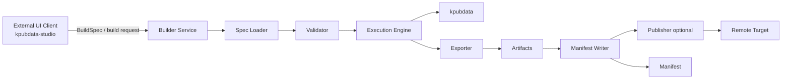

# Architecture — KPubData Builder

## 1. 역할 정의

`kpubdata-builder`는 **재현 가능한 공공데이터 데이터셋 조립을 위한 실행 엔진**입니다.

Builder의 핵심 역할은 다음과 같습니다.

- BuildSpec을 읽고 검증한다.
- `kpubdata`를 통해 source 실행을 위임한다.
- 결과 레코드를 exporter에 전달해 artifact를 만든다.
- 모든 실행을 manifest로 기록한다.
- 필요 시 publisher를 통해 외부 대상에 게시한다.

Builder는 다음을 하지 않습니다.

- provider별 API 접근 로직을 다시 구현하지 않습니다.
- Studio 같은 UI 계층의 화면 상태를 소유하지 않습니다.
- 임의의 범용 ETL 엔진이 되려고 하지 않습니다.

## 2. BuildSpec 중심 설계 원칙

이 시스템의 설계 중심은 **BuildSpec**입니다.

1. **BuildSpec이 실행의 단일 진실 공급원(single source of truth)** 입니다.
2. 실행 엔진은 spec을 해석하지만, 의미를 재정의하지 않습니다.
3. exporter와 publisher는 spec이 결정한 실행 결과를 소비하는 하위 단계입니다.
4. manifest는 실행 후 생성되는 기록물이지, 실행 규칙을 다시 정의하는 입력물이 아닙니다.
5. Studio나 다른 클라이언트는 BuildSpec을 작성·전송할 수 있지만, 계약 자체를 소유하지 않습니다.

## 3. 계층 분리

### 3.1 Execution engine

- BuildSpec 로딩/검증
- `kpubdata` 호출
- 레코드 수집 및 실행 상태 관리

### 3.2 Exporter

- 실행 결과를 파일/레이아웃 artifact로 변환
- 로컬 파일 시스템 기준 결과물 생성
- source fetch나 publish 정책은 직접 담당하지 않음

### 3.3 Publisher

- 이미 생성된 artifact를 원격 대상에 게시
- 게시 성공/실패를 실행 결과에 반영
- 파일 생성 책임은 없음

### 3.4 Manifest

- spec digest, 상태, artifact 목록, 실행 시각, 오류 요약 기록
- 성공/실패 여부와 무관하게 build run을 설명하는 감사 기록
- exporter/publisher를 대체하는 실행 단계가 아님

## 4. 외부 통합 지점

Builder는 외부와 다음 경계로 연결됩니다.

| 외부 시스템 | Builder가 받는 것 | Builder가 제공하는 것 |
| :--- | :--- | :--- |
| `kpubdata` | 정규화된 레코드 접근 | source 실행 위임 |
| 파일 시스템 | output 디렉터리 | artifact, manifest |
| 원격 게시 대상 | 게시 대상 설정/자격 증명 | 게시 요청 |
| `kpubdata-studio` | BuildSpec, 실행 요청 | 검증 결과, preview, build 상태, manifest |

Studio는 여기서 **external UI client**로만 동작합니다.

## 5. 파이프라인 흐름



```text
Studio/UI -> Builder Service -> Spec Loader -> Validator -> Execution Engine
           -> Exporter -> Artifacts -> Manifest Writer -> Publisher(optional)
```

## 6. 내부 책임 지도

| 단계 | 입력 | 출력 | 실패 시 영향 |
| :--- | :--- | :--- | :--- |
| Spec Loader | YAML/구조화된 spec | BuildSpec 객체 | build 시작 불가 |
| Validator | BuildSpec | 검증 결과 | `failed`로 종료 |
| Execution Engine | 검증된 BuildSpec | 정규화 레코드/실행 메타데이터 | export 이전에 중단 가능 |
| Exporter | 레코드 + export 설정 | artifact 목록 | publish 이전에 중단 |
| Manifest Writer | spec digest + 실행 결과 | manifest.json | 감사 기록 상실 위험 |
| Publisher | artifact + publish 설정 | 게시 결과 | artifact는 유지될 수 있음 |

## 7. Builder-Studio 연결 원칙

- Studio는 BuildSpec을 **작성하고 전송**할 수 있지만, BuildSpec 계약을 정의하지 않습니다.
- Preview 계산은 Builder에서 수행되며 Studio는 결과를 렌더링합니다.
- Build 상태 머신은 Builder가 소유하며 Studio는 조회/표시만 합니다.
- Manifest 스키마는 Builder가 소유하며 Studio는 이를 소비합니다.

자세한 경계는 [BOUNDARY.md](./BOUNDARY.md)를 참고하세요.

## 8. 관련 문서

| 문서 | 설명 |
| :--- | :--- |
| [BUILD_SPEC.md](./BUILD_SPEC.md) | BuildSpec 계약 |
| [API_CONTRACT.md](./API_CONTRACT.md) | Builder 중심 API 계약 |
| [BUILD_STATE.md](./BUILD_STATE.md) | 빌드 상태 머신 |
| [BOUNDARY.md](./BOUNDARY.md) | Builder-Studio 경계 |
| [ROADMAP.md](./ROADMAP.md) | 향후 확장 계획 |
