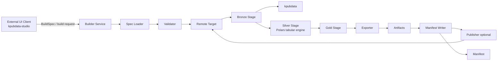

# 아키텍처 — KPubData Builder

## 1. 역할 정의

`kpubdata-builder`는 **재현 가능한 공공데이터 데이터셋 조립을 위한 Medallion 실행 엔진**입니다.

Builder의 핵심 역할은 다음과 같습니다.

- BuildSpec을 읽고 검증한다.
- `kpubdata`를 통해 Bronze source fetch를 위임한다.
- Bronze/Silver/Gold 단계를 오케스트레이션한다.
- Gold 결과를 exporter에 전달해 artifact를 만든다.
- 모든 실행을 manifest로 기록한다.
- 필요 시 publisher를 통해 외부 대상에 게시한다.

Builder는 다음을 하지 않습니다.

- provider별 API 접근 로직을 다시 구현하지 않습니다.
- Studio 같은 UI 계층의 화면 상태를 소유하지 않습니다.
- 임의의 범용 ETL 엔진이 되려고 하지 않습니다.

## 2. BuildSpec 중심 설계 원칙

이 시스템의 설계 중심은 **BuildSpec**입니다.

1. **BuildSpec이 실행의 단일 진실 공급원(single source of truth)** 입니다.
2. 실행 엔진은 spec을 해석하지만, 의미를 재정의하지 않습니다.
3. Bronze/Silver/Gold는 orchestrator가 관리하는 내부 실행 단계이며, exporter와 publisher는 Gold 결과를 소비하는 하위 단계입니다.
4. manifest는 실행 후 생성되는 기록물이지, 실행 규칙을 다시 정의하는 입력물이 아닙니다.
5. Studio나 다른 클라이언트는 BuildSpec을 작성·전송할 수 있지만, 계약 자체를 소유하지 않습니다.

## 3. 계층 분리

### 3.1 파이프라인 오케스트레이터

- BuildSpec 로딩/검증
- Bronze/Silver/Gold stage 전이 관리
- run workspace(`build/{run_id}/bronze/`, `silver/`, `gold/`) 관리

### 3.2 Bronze 단계

- `kpubdata` 호출로 원시 fetch 수행
- source snapshot 저장
- provenance logging 기록

### 3.3 Silver 단계

- Bronze snapshot을 표 형태로 정렬
- **Polars 단일 내부 엔진**으로 tabularize 수행
- schema validation, statistics, preview generation 수행

### 3.4 Gold 단계

- Silver 결과를 split-ready package로 조립
- export-ready artifact 집합 준비
- exporter/publisher가 소비할 기준 패키지 생성

### 3.5 Exporter

- Gold package를 파일/레이아웃 artifact로 변환
- 로컬 파일 시스템 기준 결과물 생성
- source fetch나 stage promotion 정책은 직접 담당하지 않음

### 3.6 Publisher

- 이미 생성된 artifact를 원격 대상에 게시
- 게시 성공/실패를 실행 결과에 반영
- 파일 생성 책임은 없음

### 3.7 Manifest

- spec digest, 상태, artifact 목록, 실행 시각, 오류 요약 기록
- stage별 산출물과 승격 결과 기록 가능
- 성공/실패 여부와 무관하게 build run을 설명하는 감사 기록
- exporter/publisher를 대체하는 실행 단계가 아님

## 4. 외부 통합 지점

Builder는 외부와 다음 경계로 연결됩니다.

| 외부 시스템 | Builder가 받는 것 | Builder가 제공하는 것 |
| :--- | :--- | :--- |
| `kpubdata` | 정규화된 레코드 접근 | Bronze source 실행 위임 |
| 파일 시스템 | output 디렉터리 | artifact, manifest |
| 원격 게시 대상 | 게시 대상 설정/자격 증명 | 게시 요청 |
| `kpubdata-studio` | BuildSpec, 실행 요청 | 검증 결과, stage-aware preview, build 상태, manifest |

Studio는 여기서 **외부 UI 클라이언트**로만 동작합니다.

## 5. Medallion 파이프라인 흐름



```text
Studio/UI -> Builder Service -> Spec Loader -> Validator -> Pipeline Orchestrator
           -> Bronze(raw fetch) -> Silver(Polars tabularize/validate) -> Gold(package)
           -> Exporter -> Artifacts -> Manifest Writer -> Publisher(optional)
```

## 6. 내부 책임 지도

| 단계 | 입력 | 출력 | 실패 시 영향 |
| :--- | :--- | :--- | :--- |
| Spec Loader | YAML/구조화된 spec | BuildSpec 객체 | build 시작 불가 |
| Validator | BuildSpec | 검증 결과 | `failed`로 종료 |
| Bronze 단계 | 검증된 BuildSpec | raw snapshot + provenance | Silver 이전에 중단 |
| Silver 단계 | Bronze snapshot | Polars table + schema/stats/preview | Gold 이전에 중단 |
| Gold 단계 | Silver dataset | split-ready/export-ready package | export 이전에 중단 |
| Exporter | Gold package + export 설정 | artifact 목록 | publish 이전에 중단 |
| Manifest Writer | spec digest + 실행 결과 | manifest.json | 감사 기록 상실 위험 |
| Publisher | artifact + publish 설정 | 게시 결과 | artifact는 유지될 수 있음 |

## 7. 목표 디렉터리 구조

```text
src/kpubdata_builder/
├── pipeline/
│   └── orchestrator.py
├── stages/
│   ├── bronze/
│   ├── silver/
│   └── gold/
├── tabular/
│   └── polars_*.py
├── exporters/
├── publishers/
├── spec.py
├── manifest.py
└── ...

build/{run_id}/
├── bronze/
├── silver/
└── gold/
```

위 구조의 핵심은 다음과 같습니다.

- stage 구현은 `stages/bronze`, `stages/silver`, `stages/gold`에 분리합니다.
- stage 흐름 제어는 `pipeline/orchestrator.py`가 담당합니다.
- tabular 처리는 **Polars 단일 엔진**만 사용하며 dual-engine 전략은 두지 않습니다.
- run workspace는 `build/{run_id}/bronze/`, `silver/`, `gold/`로 고정해 재현성과 디버깅 가능성을 높입니다.

## 8. Builder-Studio 연결 원칙

- Studio는 BuildSpec을 **작성하고 전송**할 수 있지만, BuildSpec 계약을 정의하지 않습니다.
- Preview 계산은 Builder에서 수행되며 Studio는 stage-aware 결과를 렌더링합니다.
- Build 상태 머신은 Builder가 소유하며 Studio는 조회/표시만 합니다.
- Manifest 스키마는 Builder가 소유하며 Studio는 이를 소비합니다.

자세한 경계는 [BOUNDARY.md](./BOUNDARY.md)를 참고하세요.

## 9. 빌드 실행 경로 — 정식 vs 레거시 (#208)

코드베이스에는 두 실행 경로가 공존한다. 혼란을 막기 위해 **정식 경로를 다음과 같이
확정**한다.

### 9.1 정식 경로 — 메달리온 오케스트레이터

```
kpubdata_builder.pipeline.run_build(spec, client=..., output_root=..., run_id=...)
```

- 입력은 `BuildSpec`이며, 진입점에서 `validate_spec()`로 fail-fast 검증한다(#212).
- Bronze → Silver → Gold를 오케스트레이션하고, **단일** manifest 생성기
  (`kpubdata_builder.manifest`)로 스키마 버전·빌드 환경·입력 지문을 기록한다(#211).
- `kpubdata_builder.service`(HTTP)와 `kpubdata_builder.cli`가 모두 이 경로를 호출한다.
- **신규 기능과 버그 수정은 이 경로에만 추가한다.**

### 9.2 레거시 경로 — 스크립트 기반 publish 파이프라인

```
scripts/publish_to_hf.py  →  scripts/pipeline/{fetch,transform,package,publish}.py
```

- BuildSpec과 다른 자체 config 스키마(`scripts/configs/*.yaml`)를 쓰며, data.go.kr →
  HuggingFace/Kaggle 직접 publish(checkpoint/resume, variant, dataset card)를 담당한다.
- GitHub Actions `publish-dataset.yml` 및 스케줄 워크플로에 연결된 **프로덕션 경로**다.
- 해당 모듈에는 `DEPRECATED` 표시가 붙어 있으며, 프로덕션 호환을 위해서만 유지한다.

### 9.3 통합 계획 (follow-up)

두 경로는 config 스키마가 근본적으로 다르고 레거시 경로가 프로덕션에 연결돼 있어 즉시
병합은 회귀 위험이 크다. 단계적 통합:

1. **(완료)** 정식 경로를 메달리온으로 확정하고 레거시 모듈 deprecate.
2. 레거시 config → `BuildSpec` 변환 어댑터 도입.
3. fetch/transform/package를 메달리온 stage 호출로 치환하고 publish만 publisher 계층에
   위임.
4. variant/checkpoint 등 publish 전용 기능을 메달리온에서 동등 제공한 뒤 스케줄
   워크플로를 새 진입점으로 전환하고 레거시 스크립트 제거.

각 단계는 publish 워크플로의 라이브 재검증을 동반한다.

## 10. 관련 문서

| 문서 | 설명 |
| :--- | :--- |
| [BUILD_SPEC.md](./BUILD_SPEC.md) | BuildSpec 계약 |
| [API_CONTRACT.md](./API_CONTRACT.md) | Builder 중심 API 계약 |
| [BUILD_STATE.md](./BUILD_STATE.md) | 빌드 상태 머신 |
| [ALGORITHM.md](./ALGORITHM.md) | 전체 빌드 알고리즘 명세 |
| [BOUNDARY.md](./BOUNDARY.md) | Builder-Studio 경계 |
| [ROADMAP.md](./ROADMAP.md) | 향후 확장 계획 |
