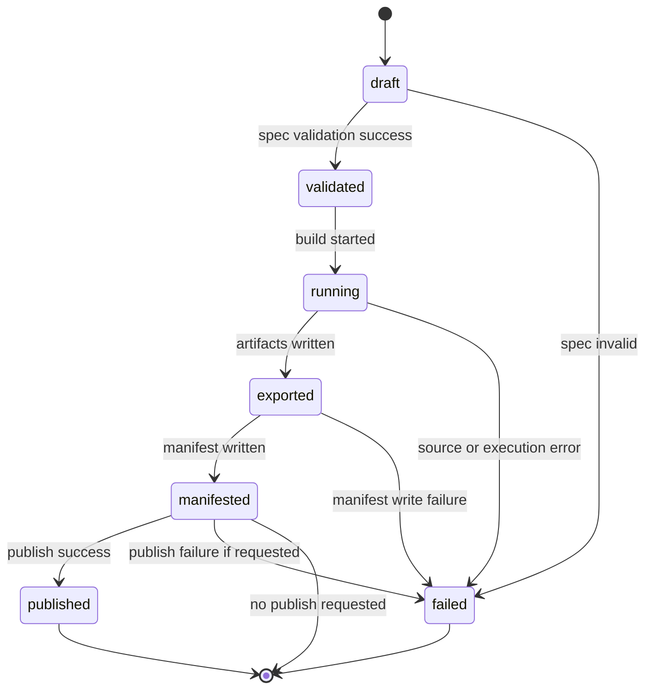

# Build Run State Machine — KPubData Builder

## 1. 상태 개요

Builder의 build run은 다음 상태를 따릅니다.

`draft → validated → running → exported → manifested → published`

실패 시에는 어느 단계에서든 `failed`로 전이될 수 있습니다.

## 2. 상태 전이 다이어그램

## 3. 상태별 출력물

| 상태 | 의미 | 기대 출력 |
| :--- | :--- | :--- |
| `draft` | spec가 아직 검증 전 | 원본 요청/spec |
| `validated` | 실행 가능한 BuildSpec 확인 완료 | 검증 결과, spec digest 가능 |
| `running` | source 실행 및 조립 진행 중 | 진행 상태, 임시 실행 메타데이터 |
| `exported` | artifact 생성 완료 | artifact 목록, 파일 경로 |
| `manifested` | manifest 생성 완료 | `manifest.json`, build 요약 |
| `published` | publish까지 성공 | 게시 결과, 원격 참조 |
| `failed` | 어느 단계에서든 실패 | 오류 코드/메시지, 가능하면 실패 manifest |

## 4. 상태별 산출 정책

### `draft`
- BuildSpec은 접수되었지만 실행 전입니다.
- artifact는 존재하지 않습니다.

### `validated`
- 필수 필드와 계약 규칙이 통과되었습니다.
- 실행 큐 투입 전 상태로 사용할 수 있습니다.

### `running`
- Builder가 `kpubdata` 호출 및 조립을 수행합니다.
- 외부 UI는 이 상태를 폴링하여 표시할 수 있습니다.

### `exported`
- 최소 하나 이상의 artifact가 로컬 출력 경로에 기록되었습니다.
- 아직 manifest가 없을 수 있으므로 build 완료로 간주하지 않습니다.

### `manifested`
- manifest가 생성된 시점입니다.
- publish가 없거나 나중에 수행되는 경우, 이 상태가 build 성공의 기본 완료 지점입니다.

### `published`
- publish 요청이 있었고 모든 게시 작업이 성공했습니다.

### `failed`
- 검증, 실행, export, manifest, publish 중 어느 단계에서든 실패한 상태입니다.

## 5. Partial success 정책

기본 정책은 다음과 같습니다.

1. **source 일부 성공을 전체 성공으로 간주하지 않습니다.**
2. 필수 source 중 하나라도 실패하면 build 상태는 `failed`입니다.
3. export 완료 후 publish만 실패한 경우:
   - artifact는 남을 수 있습니다.
   - build run은 `failed`로 기록합니다.
   - manifest에는 artifact 존재와 publish 실패를 함께 기록합니다.

즉, Builder는 **부분 성공을 기록할 수는 있지만 성공 상태로 승격시키지 않습니다.**

## 6. Retry 규칙

| 실패 지점 | 재시도 가능성 | 규칙 |
| :--- | :--- | :--- |
| validation 실패 | 낮음 | spec 수정 후 새 build 생성 |
| source 실행 실패 | 중간 | retryable 원인일 때 새 run 또는 재시도 가능 |
| export 실패 | 중간 | 출력 경로/권한 수정 후 재실행 |
| manifest 실패 | 낮음 | 동일 입력으로 새 build 권장 |
| publish 실패 | 높음 | 기존 manifested build에서 publish만 재시도 가능 |

재시도 원칙:

- `draft`/`validated` 이전 오류는 같은 run을 복구하기보다 새 run을 생성하는 것이 명확합니다.
- `manifested` 이후 publish 실패는 **publish 재시도**를 별도 작업으로 허용할 수 있습니다.

## 7. Manifest 생성 시점

Manifest는 **artifact 생성 직후, publish 이전**에 생성하는 것을 기본으로 합니다.

이유:

- publish 실패 여부와 무관하게 build 결과를 감사 가능하게 남길 수 있습니다.
- publish 단계가 후속 비동기 작업일 때도 build 산출 자체는 안정적으로 기록됩니다.

publish가 요청된 경우에는 publish 결과를 반영한 후 manifest를 업데이트하거나, publish 기록을 별도 항목으로 추가할 수 있습니다. 단, **manifest 스키마 소유권은 항상 Builder에 있습니다.**

## 8. 관련 문서

| 문서 | 설명 |
| :--- | :--- |
| [API_CONTRACT.md](./API_CONTRACT.md) | 상태 조회 API |
| [ALGORITHM.md](./ALGORITHM.md) | 전체 빌드 알고리즘 명세 |
| [BUILD_SPEC.md](./BUILD_SPEC.md) | 입력 계약 |
| [BOUNDARY.md](./BOUNDARY.md) | UI와의 경계 |
