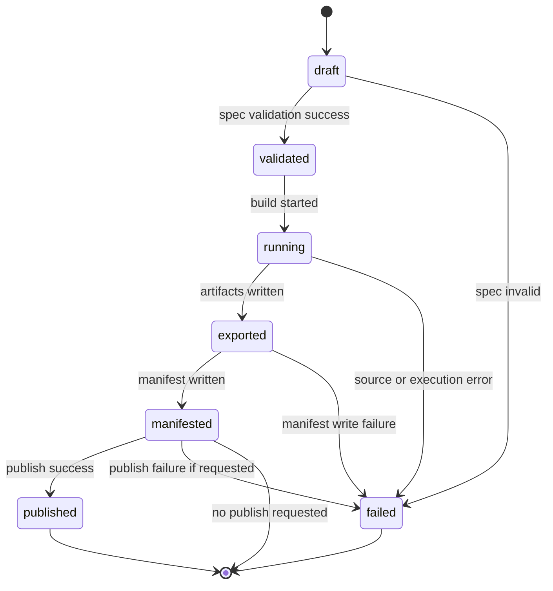
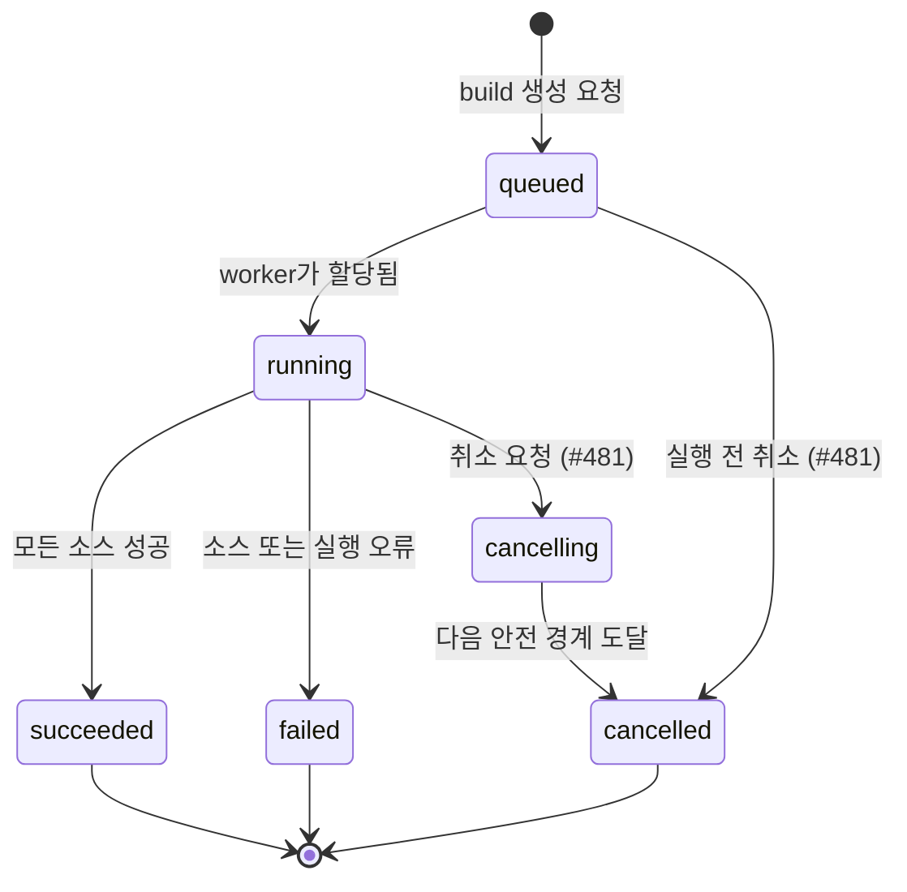

# Build Run State Machine — KPubData Builder

> **계약 범위**: v0.4의 최초 범위는 동기식 build였지만, 현재 HTTP 계약에는
> 비동기 build job과 협력적 취소가 포함됩니다. 실제 wire 계약은
> `contract/builder-api.yaml`을 정본으로 합니다.

## 1. 상태 개요

Builder의 build run은 다음 상태를 따릅니다.

`draft → validated → running → exported → manifested → published`

실패 시에는 어느 단계에서든 `failed`로 전이될 수 있습니다.

## 2. 상태 전이 다이어그램

```mermaid
stateDiagram-v2
    [*] --> draft
    draft --> validated: spec validation success
    draft --> failed: spec invalid
    validated --> running: build started
    running --> exported: artifacts written
    running --> failed: source or execution error
    exported --> manifested: manifest written
    exported --> failed: manifest write failure
    manifested --> published: publish success
    manifested --> failed: publish failure if requested
    manifested --> [*]: no publish requested
    published --> [*]
    failed --> [*]
```

## 3. 상태별 출력물

| 상태 | 의미 | 기대 출력 |
| :--- | :--- | :--- |
| `draft` | spec가 아직 검증 전 | 원본 요청/spec |
| `validated` | 실행 가능한 BuildSpec 확인 완료 | 검증 결과, spec digest 가능 |
| `running` | source 실행 및 조립 진행 중 | 진행 상태, 임시 실행 메타데이터 |
| `exported` | artifact 생성 완료 | artifact 목록, 파일 경로 |
| `manifested` | manifest 생성 완료 | `manifest.json`, build 요약 |
| `published` | publish까지 성공 | 게시 결과, 원격 참조 |
| `failed` | 어느 단계에서든 실패 | 오류 코드/메시지, 가능하면 실패 manifest |

## 4. 상태별 산출 정책

### `draft`
- BuildSpec은 접수되었지만 실행 전입니다.
- artifact는 존재하지 않습니다.

### `validated`
- 필수 필드와 계약 규칙이 통과되었습니다.
- 실행 큐 투입 전 상태로 사용할 수 있습니다.

### `running`
- Builder가 `kpubdata` 호출 및 조립을 수행합니다.
- 외부 UI는 이 상태를 폴링하여 표시할 수 있습니다.

### `exported`
- 최소 하나 이상의 artifact가 로컬 출력 경로에 기록되었습니다.
- 아직 manifest가 없을 수 있으므로 build 완료로 간주하지 않습니다.

### `manifested`
- manifest가 생성된 시점입니다.
- publish가 없거나 나중에 수행되는 경우, 이 상태가 build 성공의 기본 완료 지점입니다.

### `published`
- publish 요청이 있었고 모든 게시 작업이 성공했습니다.

### `failed`
- 검증, 실행, export, manifest, publish 중 어느 단계에서든 실패한 상태입니다.

## 5. Partial success 정책

기본 정책은 다음과 같습니다.

1. **source 일부 성공을 전체 성공으로 간주하지 않습니다.**
2. 필수 source 중 하나라도 실패하면 build 상태는 `failed`입니다.
3. export 완료 후 publish만 실패한 경우:
   - artifact는 남을 수 있습니다.
   - build run은 `failed`로 기록합니다.
   - manifest에는 artifact 존재와 publish 실패를 함께 기록합니다.

즉, Builder는 **부분 성공을 기록할 수는 있지만 성공 상태로 승격시키지 않습니다.**

## 6. Retry 규칙

| 실패 지점 | 재시도 가능성 | 규칙 |
| :--- | :--- | :--- |
| validation 실패 | 낮음 | spec 수정 후 새 build 생성 |
| source 실행 실패 | 중간 | retryable 원인일 때 새 run 또는 재시도 가능 |
| export 실패 | 중간 | 출력 경로/권한 수정 후 재실행 |
| manifest 실패 | 낮음 | 동일 입력으로 새 build 권장 |
| publish 실패 | 높음 | 기존 manifested build에서 publish만 재시도 가능 |

재시도 원칙:

- `draft`/`validated` 이전 오류는 같은 run을 복구하기보다 새 run을 생성하는 것이 명확합니다.
- `manifested` 이후 publish 실패는 **publish 재시도**를 별도 작업으로 허용할 수 있습니다.

## 7. Manifest 생성 시점

Manifest는 **artifact 생성 직후, publish 이전**에 생성하는 것을 기본으로 합니다.

이유:

- publish 실패 여부와 무관하게 build 결과를 감사 가능하게 남길 수 있습니다.
- publish 단계가 후속 비동기 작업일 때도 build 산출 자체는 안정적으로 기록됩니다.

publish가 요청된 경우에는 publish 결과를 반영한 후 manifest를 업데이트하거나, publish 기록을 별도 항목으로 추가할 수 있습니다. 단, **manifest 스키마 소유권은 항상 Builder에 있습니다.**

## 8. 비동기 Job 상태 머신 (미래 계획)

> **x-planned**: 이 섹션은 미래 비동기 모드를 위해 문서화되었습니다. v0.4 호출 계약에는 포함되지 않습니다.

비동기 실행 모드에서는 build run이 다음 상태를 따릅니다.

`queued → running → succeeded` 또는 `failed` 또는 `cancelled`

### 8.1 상태 정의

| 상태 | 의미 |
| :--- | :--- |
| `queued` | 실행 대기열에 진입하여 실행을 기다리는 상태 |
| `running` | Builder가 source를 fetch하고 조립을 수행 중인 상태 |
| `cancelling` | 취소가 요청되었고 다음 안전 경계에서 종료를 기다리는 과도기 상태 (#481) |
| `succeeded` | 모든 source가 성공하고 artifact/manifest가 생성된 상태 |
| `failed` | source 실행 또는 조립 중 실패한 상태 |
| `cancelled` | 사용자 요청으로 실행이 취소된 상태 |

### 8.2 상태 전이 다이어그램

```mermaid
stateDiagram-v2
    [*] --> queued: build 생성 요청
    queued --> running: worker가 할당됨
    running --> succeeded: 모든 소스 성공
    running --> failed: 소스 또는 실행 오류
    running --> cancelling: 취소 요청 (#481)
    cancelling --> cancelled: 다음 안전 경계 도달
    queued --> cancelled: 실행 전 취소 (#481)
    cancelled --> [*]
    failed --> [*]
    succeeded --> [*]
```

### 8.3 현재 계약

`POST /build`는 동기식 실행을 유지합니다. 비동기 job은 `POST /builds`,
`GET /builds/{run_id}`, `POST /builds/{run_id}/cancel`로 제공하며, 세 endpoint의
wire 형태와 상태 코드는 `contract/builder-api.yaml`을 따릅니다.

#### 현재 구현 상태

v0.4에서는 ADR 0002에 따라 비동기 API가 호출 계약에서 제외되었으나,
후속 async 작업(#480~#483)을 통해 비동기 build 제출/조회가 구현되었다.

#481에서는 이에 cooperative cancellation을 추가한다.

- queued → cancelled
- running → cancelling → cancelled
- safe stage boundary에서 cancellation 확인
- 이미 생성된 산출물은 partial manifest로 보존

### 8.4 협력적 취소와 partial manifest (#481)

`POST /builds/{run_id}/cancel`은 **협력적(cooperative)** 취소만 수행합니다. worker
thread를 강제로 종료하지 않고, 실행 중인 stage를 중간에 끊지 않습니다.

**전이 규칙**

| 요청 시점 상태 | 결과 | HTTP |
| :--- | :--- | :--- |
| `queued` | 즉시 `cancelled`. worker가 runner를 **한 번도 호출하지 않음** | 200 |
| `running` | `cancelling`. 다음 안전 경계에서 `cancelled` | 200 |
| `cancelling` / `cancelled` | 상태 변화 없음(멱등) | 200 |
| `succeeded` / `failed`, 또는 pipeline이 정상 종료로 확정한 job | 취소 불가 | 409 |

종단 상태(`succeeded`/`failed`/`cancelled`)는 다시 `running`/`cancelling`으로
돌아가지 않습니다. `cancelling → succeeded` 전이는 존재하지 않습니다 — pipeline이
마지막 안전 경계를 지나 정상 종료로 확정하면(point of no return) 그 이후의 취소
요청은 409로 거절됩니다.

**안전 경계**

source 하나의 파이프라인에서 취소는 다음 네 지점에서만 관찰됩니다.

1. source fetch를 시작하기 전
2. Bronze 산출물이 기록된 뒤, Silver 시작 전
3. Silver 산출물이 기록된 뒤, Gold 시작 전
4. Gold 산출물이 기록된 뒤, export 시작 전

그리고 모든 source가 끝난 뒤 composition/manifest finalize 직전에 마지막 경계가
있습니다. 취소가 관찰되면 그 다음 단계(composition 포함)는 **시작하지 않습니다**.

**partial manifest**

pipeline 실행이 시작되어 산출물을 생성한 cancelled run은 partial manifest를
반드시 남깁니다. 실행 전에 취소된 queued job은 runner를 실행하지 않으므로 artifact와
manifest를 생성하지 않습니다.
`BuildManifest`에 두 개의 additive 필드가 추가됩니다.

| 필드 | 값 | 의미 |
| :--- | :--- | :--- |
| `status` | `ok` / `failed` / `cancelled` | run의 종단 상태. legacy manifest에는 이 필드가 없으며, reader는 부재 시 기존대로 `errors` 유무에서 파생해야 합니다 |
| `partial` | `true` / `false` | 정상 완료 전에 종료되어 `outputs`가 부분 산출물임을 뜻합니다. 현재는 `status: cancelled`인 run에만 `true`입니다 |

partial manifest 보장 사항:

- `outputs`에는 취소 시점까지 **실제로 기록된 산출물만** 담깁니다. 실행되지 않은
  stage는 성공으로 기록되지 않습니다.
- 취소를 실패로 위장하지 않습니다 — `errors`에 취소 사유를 넣지 않습니다.
- 반대로 실패를 취소로 삼키지도 않습니다 — 이미 실패한 source의 사유는 `errors`에
  그대로 남고, run의 종단 상태만 `cancelled`입니다.
- raw exception, stack trace, 내부 경로, credential은 담기지 않습니다.
- BuildIndex에는 `status='cancelled'`로 기록되며, `manifest.json`이 정본이므로
  인덱스를 재구축해도(`rebuild_index`) 취소 상태가 보존됩니다. cancelled run은
  "최근 성공 빌드"로 승격되지 않습니다.

**보존 정책 (#549)**

부분 산출물은 **기본적으로 삭제하지 않습니다**(감사·디버깅 근거). 정리는
명시적 opt-in로만 일어납니다:

- CLI `kpubdata-builder prune-cancelled --output-dir <root> [--ttl-hours N] [--apply]`
  — 기본은 dry-run(대상 나열만), `--apply`를 줘야 삭제됩니다.
- TTL은 `--ttl-hours` 인자가 우선, 없으면 환경변수
  `KPUBDATA_BUILDER_CANCELLED_RUN_TTL_HOURS`, 그마저 없으면 **비활성**(그 무엇도
  삭제 대상이 아님)입니다. `finished_at`을 알 수 없는 run은 나이를 판정할 수
  없어 항상 보존됩니다.
- 삭제 단위는 run workspace(``{output_root}/{run_id}``) 디렉터리뿐이며 run_id는
  경로 세그먼트 검증을 통과해야 합니다. 서비스 내부 상태
  (`_publish_receipts.sqlite` 등)는 건드리지 않습니다.

**`cancelling` 중 프로세스 크래시·재기동**

job registry는 메모리 상태이므로 프로세스가 죽으면 `cancelling`/`running` job의
진행 상황은 모두 사라집니다. 재기동 시:

- manifest.json이 이미 `status: cancelled`로 기록된 run: 종단 상태 그대로
  보존됩니다(manifest가 정본). partial 산출물도 그대로 남습니다.
- 안전 경계에 도달하기 전에 죽은 run(manifest 없음): run workspace에 부분
  산출물만 남은 고아 상태가 됩니다. 재기동이 이를 자동으로 정리하거나
  `cancelled`로 표시하지 **않습니다** — `rebuild-index`는 manifest 없는 run을
  인덱스에 넣지 않으므로 고아 산출물은 API에 노출되지 않고, 정리는 위
  `prune-cancelled` dry-run으로 운영자가 확인한 뒤 수행합니다.
- 동일 run_id의 재제출은 기존 멱등 규칙(ADR 0008)을 따릅니다.

### 8.5 관련 ADR

- ADR 0002(#308): Build 실행 모델 결정 (동기 vs 비동기)
- ADR 0005(#311): API 계약 단일 소스 및 코드 생성 전략
- ADR 0008(#334): 비동기 build job 모델(취소·부분 산출물 규약) — 제안됨

## 9. 관련 문서

| 문서 | 설명 |
| :--- | :--- |
| [API_CONTRACT.md](./API_CONTRACT.md) | 상태 조회 API |
| [ALGORITHM.md](./ALGORITHM.md) | 전체 빌드 알고리즘 명세 |
| [BUILD_SPEC.md](./BUILD_SPEC.md) | 입력 계약 |
| [BOUNDARY.md](./BOUNDARY.md) | UI와의 경계 |
