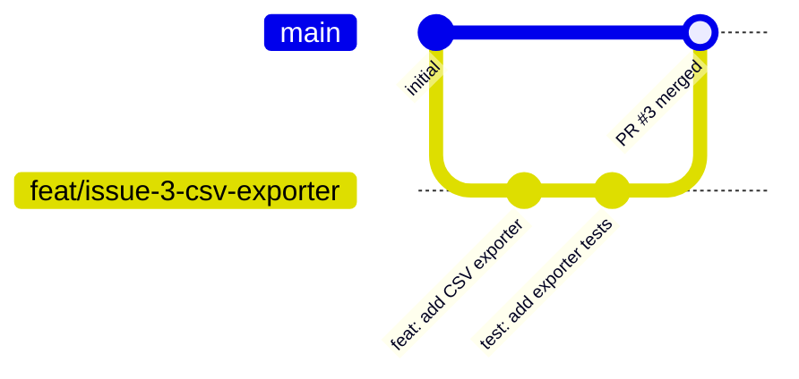
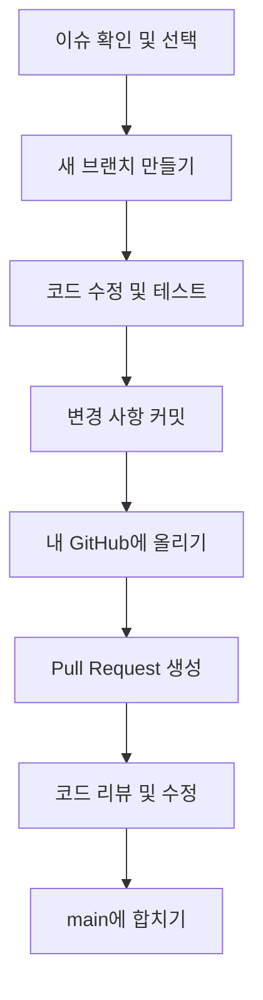

# KPubData-Builder 기여 가이드 (CONTRIBUTING.md)

KPubData-Builder 프로젝트에 기여하고 싶으신가요? 환영합니다! 이 프로젝트는 KPubData에서 가져온 데이터를 다양한 형식(CSV, JSON, SQL 등)으로 가공하고 내보내는 역할을 합니다.

## 1. 환영 인사 및 프로젝트 소개

KPubData 패밀리 소개:
- **kpubdata**: 핵심 라이브러리 (데이터 수집)
- **kpubdata-builder**: 데이터를 내보내고 가공하는 엔진
- **kpubdata-studio**: dataset workbench UI

이 레포지토리(`kpubdata-builder`)는 Medallion Architecture 기반으로 데이터를 Bronze/Silver/Gold 단계에서 정제하고 특정 파일 포맷으로 변환하는 기능을 개발하는 곳입니다.

## 2. 개발 환경 설정 (처음부터 끝까지)

이 프로젝트는 파이썬(Python) 기반으로 만들어졌습니다. 개발을 시작하기 위해 필요한 도구들을 하나씩 설치해 봅시다.

### Step 1: 필수 도구 설치
1.  **Git**: 코드의 버전을 관리하는 도구입니다. [공식 사이트](https://git-scm.com)에서 설치하세요. 설치 후 터미널(Terminal)에서 `git --version`을 입력해 버전이 나오는지 확인합니다.
2.  **Python 3.10+**: 프로젝트의 기반 언어입니다. `python --version`으로 3.10 이상의 버전인지 확인하세요.
3.  **uv**: 파이썬 패키지와 가상 환경을 아주 빠르게 관리해주는 도구입니다. 아래 명령어로 설치할 수 있습니다.
    ```bash
    curl -LsSf https://astral.sh/uv/install.sh | sh
    ```
    설치 후 `uv --version`이 작동하는지 확인하세요.
4.  **GitHub 계정 및 SSH 키**: 코드를 올리기 위해 필요합니다. [GitHub SSH 키 설정 가이드](https://docs.github.com/en/authentication/connecting-to-github-with-ssh)를 참고해 설정해 주세요.

### Step 2: Fork & Clone
프로젝트를 내 컴퓨터로 가져오는 과정입니다.
1.  GitHub 상단의 **Fork** 버튼을 눌러 본인의 계정으로 저장소를 복사합니다.
2.  터미널을 열고 아래 명령어를 입력하여 내 컴퓨터에 코드를 다운로드합니다.
    ```bash
    # YOUR_USERNAME 부분을 본인의 GitHub 아이디로 바꾸세요.
    git clone https://github.com/YOUR_USERNAME/kpubdata-builder.git
    cd kpubdata-builder

    # 원본 저장소(upstream)를 등록하여 나중에 업데이트를 받기 쉽게 합니다.
    git remote add upstream https://github.com/yeongseon/kpubdata-builder.git
    ```

### Step 3: 개발 환경 구축
`uv`를 사용하여 필요한 라이브러리를 설치하고 프로젝트가 잘 작동하는지 확인합니다.
```bash
# 필요한 라이브러리 설치 (개발용 도구 포함)
uv sync --extra dev

# 모든 기능이 잘 작동하는지 테스트 실행
uv run pytest

# 코드에 문법적 오류나 스타일 문제가 없는지 확인 (Linter)
uv run ruff check .

# 데이터 타입이 올바르게 사용되었는지 확인 (Type Checker)
uv run mypy src
```

### Step 3-1: 의존성 해석 전략 (Dependency-Resolution Strategy)

`kpubdata-builder`는 `kpubdata`를 두 가지 방법으로 해석합니다. 상황에 따라 아래 중 하나를 선택하세요.

#### 로컬 개발 (Local Development) — 기본 권장 방식

`pyproject.toml`의 `[tool.uv.sources]` 섹션이 `kpubdata`를 **형제 디렉터리의 editable checkout**으로 연결합니다.

```toml
[tool.uv.sources]
kpubdata = { path = "../kpubdata", editable = true }
```

이 방식을 사용하려면 `kpubdata` 저장소를 **같은 부모 디렉터리에** 함께 클론해야 합니다.

```bash
# 부모 디렉터리 기준 구조
~/projects/
├── kpubdata/          # ← 이 저장소가 있어야 함
└── kpubdata-builder/  # ← 현재 저장소

git clone https://github.com/yeongseon/kpubdata.git ../kpubdata
uv sync --extra dev    # ../kpubdata 를 editable로 연결
```

형제 디렉터리가 존재하면 `uv sync`는 자동으로 PyPI 대신 로컬 소스를 사용합니다.

#### CI / PyPI 배포 — `--no-sources` 플래그

CI(`publish-dataset.yml`)와 패키지 배포 환경에서는 `--no-sources` 플래그를 사용합니다.

```bash
uv sync --extra dev --extra publish --no-sources
```

`--no-sources`는 `[tool.uv.sources]`를 무시하고, `pyproject.toml`의 `dependencies`에 명시된 **PyPI 릴리스 핀**(`kpubdata>=0.5.0,<0.6`)을 직접 설치합니다. 형제 디렉터리가 없어도 작동합니다.

#### 핀 범위(`>=0.5.0,<0.6`)를 이렇게 설정한 이유

`kpubdata-builder`는 `kpubdata` 0.5.x의 API(`Client.dataset(...).list` 등)에 의존합니다. 0.6 이상은 호환성 정책이 확정되지 않아 현재로서는 허용하지 않습니다. 호환 정책이 확정되면 상한을 올릴 예정입니다 (관련 이슈: #213).

#### 요약

| 환경 | 명령 | `kpubdata` 소스 |
| :--- | :--- | :--- |
| 로컬 개발 | `uv sync --extra dev` | `../kpubdata` (editable, 형제 디렉터리 필요) |
| CI / 배포 | `uv sync ... --no-sources` | PyPI (`kpubdata>=0.5.0,<0.6`) |

## 3. 브랜치 전략과 협업 규칙

프로젝트는 여러 사람이 함께 만듭니다. 서로의 코드가 엉키지 않도록 몇 가지 규칙을 정해두었습니다. 규칙은 적지만, **반드시 지켜야 합니다.**

### 3-1. 브랜치란? (비유)
브랜치(Branch)는 "평행 세계"와 같습니다. 원본 코드(`main`)는 그대로 둔 채, 나만의 평행 세계를 만들어 마음껏 기능을 추가하거나 수정해볼 수 있습니다. 작업이 완벽해지면 나중에 원본 세계에 합칩니다.

### 3-2. 브랜치 전략
우리는 `main` 브랜치에 직접 코드를 올리지 않습니다. 반드시 새로운 브랜치를 만들어 작업한 뒤 **Pull Request (PR)**를 통해 합칩니다.



### 3-3. 브랜치 이름 규칙
어떤 작업을 하는지 한눈에 알 수 있도록 이름을 지어주세요.

| 접두사 | 용도 | 예시 |
| :--- | :--- | :--- |
| `feat/` | 새로운 기능 추가 | `feat/issue-3-add-csv-exporter` |
| `fix/` | 버그 수정 | `fix/issue-7-manifest-encoding` |
| `docs/` | 문서 수정 | `docs/update-contributing-guide` |

- 이슈 번호가 있다면 이름에 포함해 주세요 (예: `issue-3`).

### 3-4. 전체 작업 흐름
협업의 표준 순서는 다음과 같습니다.



1.  **브랜치 생성**: `git checkout -b feat/issue-번호-설명`
2.  **작업 및 테스트**: 코드를 고치고 `uv run pytest`로 확인합니다.
3.  **커밋**: `git add .` 후 `git commit -m "feat: 메시지"`
4.  **Push**: `git push origin feat/issue-번호-설명`
5.  **PR**: GitHub 웹사이트에서 초록색 "Compare & pull request" 버튼을 누릅니다.

### 3-5. 커밋 메시지 규칙
영어로 작성하는 것을 원칙으로 하며, 첫 단어(태그)로 성격을 나타냅니다.

| 태그 | 의미 |
| :--- | :--- |
| `feat` | 새로운 기능 추가 |
| `fix` | 버그 수정 |
| `docs` | 문서 수정 (README 등) |
| `test` | 테스트 코드 추가/수정 |
| `refactor` | 코드 구조 개선 (기능 변화 없음) |

- 예: `feat: add support for parquet export`

### 3-6. 절대 금지 사항
- **main 브랜치에 직접 Push 금지**: 모든 변경은 PR을 거쳐야 합니다.
- **Force Push 금지**: `git push --force`는 다른 사람의 작업을 지울 수 있어 위험합니다.
- **타인의 브랜치 관리 금지**: 내가 만들지 않은 브랜치를 지우거나 이름을 바꾸지 마세요.
- **추측하지 마세요**: 모르는 것이 생기면 이슈나 대화방에서 언제든 물어보세요. 질문은 환영입니다!

### 3-7. PR 올리기 전 최종 체크리스트
PR을 올리기 전, 터미널에서 아래 4가지를 실행해 보세요. 모두 통과해야 합격입니다!

```bash
# 1. 코드 스타일 검사 (린트)
uv run ruff check .

# 2. 코드 포맷 자동 정리 확인
uv run ruff format --check .

# 3. 타입 검사
uv run mypy src

# 4. 전체 유닛 테스트 실행
uv run pytest
```

## 4. 코딩 컨벤션

- **정적 타입**: 모든 함수는 타입 힌트를 포함해야 합니다. `Any`는 피해주세요.
- **포맷팅**: `uv run ruff format .`으로 코드 스타일을 자동으로 정리하세요.
- **가독성**: 변수 이름은 누구나 알 수 있도록 명확하게 지어주세요.

## 5. Medallion 작업 규칙

- `stages/`를 수정하는 기여자는 **Bronze → Silver → Gold** 책임 경계를 먼저 확인해야 합니다.
- Bronze는 raw fetch/snapshot/provenance에 집중하고, Silver는 **Polars 기반 tabularize·validation·statistics·preview**에 집중하며, Gold는 split-ready/export-ready package 조립에 집중해야 합니다.
- stage 간 승격 규칙은 Builder가 소유하므로, Studio나 exporter 관점에서 임의 의미를 다시 정의하면 안 됩니다.
- run workspace는 `build/{run_id}/bronze/`, `silver/`, `gold/` 규칙을 기준으로 생각해야 합니다.

## 6. 테스트 가이드

- stage 관련 변경은 가능하면 **stage-aware 테스트**와 함께 제출하세요.
- Bronze 변경은 fixture 기반 source snapshot/provenance 검증을 우선합니다.
- Silver 변경은 Polars schema validation, statistics, preview slice 검증을 우선합니다.
- Gold 변경은 package layout, split readiness, exporter 입력 계약을 검증해야 합니다.
- exporter 변경은 기존 golden test와 함께 Gold package 입력이 깨지지 않는지도 확인하세요.

## 7. 첫 번째 내보내기 도구(Exporter) 추가하기

KPubData-Builder에 새로운 파일 형식을 추가해 봅시다.

1. `src/kpubdata_builder/exporters/` 폴더로 이동합니다.
2. `BaseExporter` 클래스를 상속받는 새로운 클래스를 만듭니다.
3. 데이터를 파일로 저장하는 로직을 구현합니다.
4. `tests/` 폴더에 테스트 파일을 작성해 기능이 잘 작동하는지 확인합니다.

## 8. PR 체크리스트

PR을 작성할 때 제목을 `[#이슈번호] 간단한 설명`으로 작성해 주세요.

- [ ] 로컬 테스트(`uv run pytest`)가 모두 성공했나요?
- [ ] 린트(`uv run ruff check .`)에서 오류가 없나요?
- [ ] 변경 사항을 잘 설명하는 테스트 코드가 포함되었나요?
- [ ] `stages/`를 건드렸다면 Medallion 책임 경계와 stage-aware 테스트를 확인했나요?

## 9. 질문과 도움

작업하다 막히면 주저하지 말고 GitHub Issues에 질문하세요! 모르는 것을 물어보는 것은 기여의 아주 중요한 시작입니다. "어디서부터 시작해야 할까요?", "이 에러는 왜 발생할까요?" 같은 질문 모두 환영합니다.

---

## 관련 문서

### 이 저장소 내 문서
| 문서 | 설명 |
| :--- | :--- |
| [AGENTS.md](./AGENTS.md) | 에이전트 개발 가이드 |
| [ARCHITECTURE.md](./ARCHITECTURE.md) | 시스템 아키텍처 설계 |
| [ROADMAP.md](./ROADMAP.md) | 프로젝트 로드맵 |

### KPubData Product Family
| 저장소 | 문서 | 설명 |
| :--- | :--- | :--- |
| [kpubdata](https://github.com/yeongseon/kpubdata) | [CONTRIBUTING.md](https://github.com/yeongseon/kpubdata/blob/main/CONTRIBUTING.md) | Core 기여 가이드 |
| [kpubdata-studio](https://github.com/yeongseon/kpubdata-studio) | [CONTRIBUTING.md](https://github.com/yeongseon/kpubdata-studio/blob/main/CONTRIBUTING.md) | Studio 기여 가이드 |
