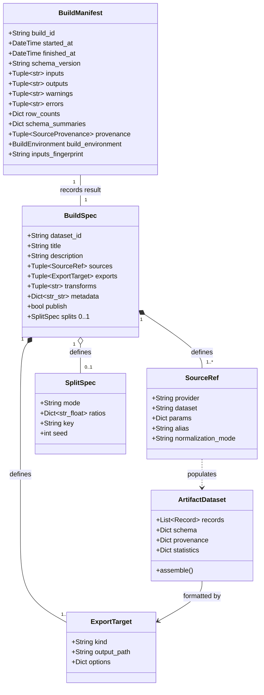
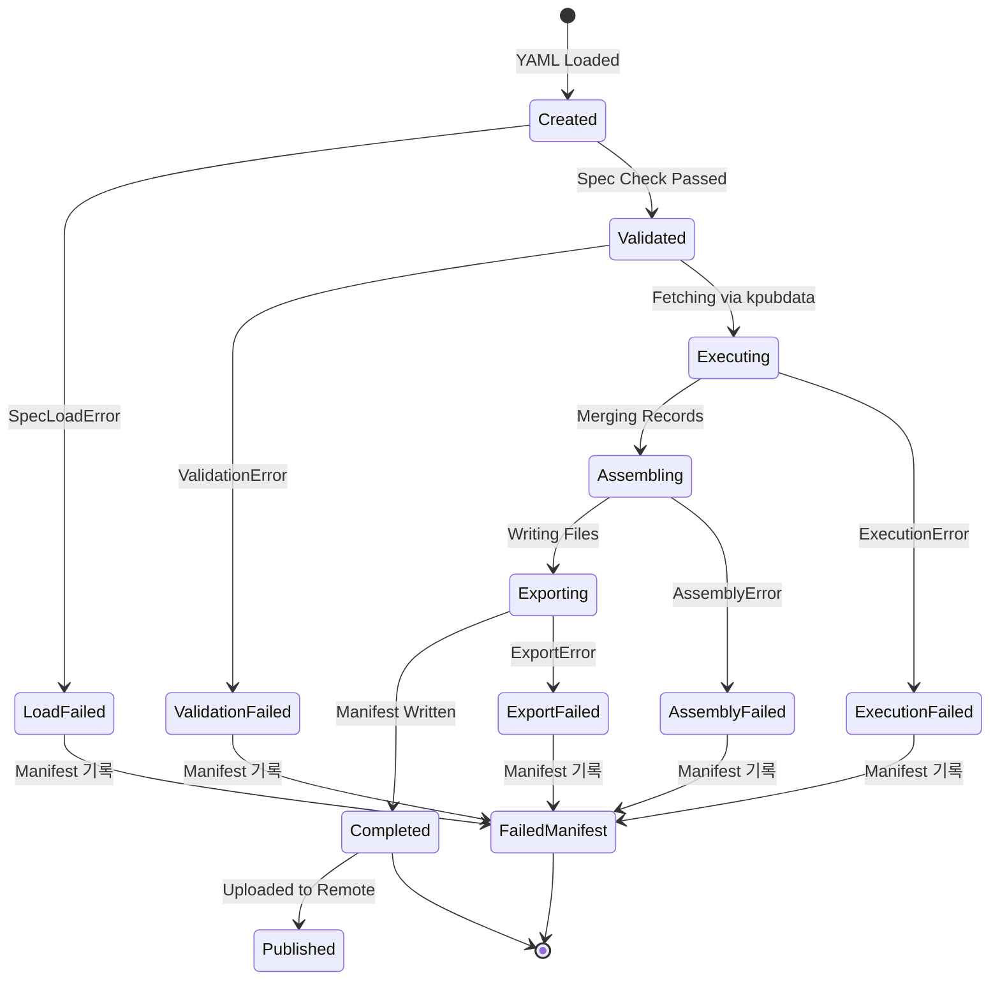
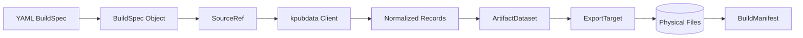

# 도메인 모델 — KPubData Builder

## 핵심 엔티티(핵심 모델 상세)



### 1. BuildSpec (빌드 기획서)
- **무엇인가요?** 어떤 데이터를 가져와서 어떤 형식으로 저장할지 정의한 문서입니다.
- **비유:** "요리 레시피"



> 모든 실패 상태에서도 Manifest는 생성됩니다. 상태 전이와 실패 처리 기준은 [BUILD_STATE.md](./BUILD_STATE.md)를 참조하세요.

### 2. SourceRef (데이터 출처 정보)
- **무엇인가요?** `kpubdata` 라이브러리를 통해 가져올 구체적인 공공데이터 정보입니다.
- **비유:** "재료를 어디서 사올지 적어둔 메모"
- **주요 필드:**
    - `provider`: provider 식별자
    - `dataset`: dataset 식별자
    - `params`: list 호출에 전달할 파라미터 (JSON 호환 값)
    - `alias`: 조립 단계에서 사용할 사용자 정의 소스 이름
    - `normalization_mode`: 정규화 모드 (`canonical` 기본값, `raw` 지원)



### 3. ArtifactDataset (조립된 데이터셋)
- **무엇인가요?** 소스에서 가져온 데이터들을 하나로 묶어놓은 메모리상의 데이터 객체입니다.
- **비유:** "요리하기 직전에 그릇에 담아둔 재료 뭉치"
- **주요 필드:**
    - `records`: 실제 데이터 레코드들의 목록 (리스트)
    - `schema`: 데이터의 각 항목이 무엇인지 정의한 정보
    - `provenance`: 이 데이터가 어디서(어떤 API에서) 왔는지 추적한 정보
    - `statistics`: 전체 데이터 건수 등 기초 통계 정보

### 4. ExportTarget (출력 대상)
- **무엇인가요?** 조립된 데이터를 어떤 형식의 파일로 만들지 정의합니다.
- **비유:** "완성된 요리를 담을 그릇의 종류 (접시, 냄비, 포장 용기 등)"
- **주요 필드:**
    - `kind`: 출력 형식의 종류 (예: `markdown`, `jsonl`, `csv`, `parquet`, `huggingface`, `kaggle`)
    - `output_path`: output_dir 기준 상대 출력 경로
    - `options`: 특정 형식에 필요한 추가 설정값 (JSON 호환 값)

### 4a. SplitSpec (데이터셋 분할 정의)
- **무엇인가요?** 데이터셋을 명명된 분할(train/val/test 등)로 나누는 방법을 정의합니다.
- **주요 필드:**
    - `mode`: 분할 방식 (`ratio`: 비율 기반, `key`: 컬럼 값 기반)
    - `ratios`: ratio 모드에서 분할 이름 → 비율 매핑 (합이 1.0이어야 함)
    - `key`: key 모드에서 분할 기준이 되는 컬럼 이름
    - `seed`: ratio 모드의 결정적 셔플 시드 (기본값: `0`)

> 계획(planned)/미구현: `SplitSpec`은 현재 파싱되어 BuildSpec에 보존되지만, 실제 분할 로직은 아직 구현되지 않았습니다.

### 5. BuildManifest (빌드 명세서)
- **무엇인가요?** 빌드가 끝난 후, 언제 어떤 데이터가 얼마나 생성되었는지 기록한 요약 파일입니다. 실패한 빌드도 manifest를 남겨 감사 추적이 가능합니다.
- **비유:** "요리 완성 후 작성하는 조리 일지 또는 영수증 (실패한 요리도 기록)"
- **주요 필드:**
    - `build_id`: 이번 빌드 실행의 고유 ID
    - `started_at` / `finished_at`: 빌드가 시작되고 끝난 시각
    - `schema_version`: 매니페스트 형식 버전 (semver, 현재 `"1.0.0"`)
    - `inputs`: 입력 소스 식별자 목록
    - `outputs`: 실제로 생성된 파일 경로 목록
    - `warnings`: 빌드 중 발생한 사소한 문제들
    - `errors`: 빌드 실패 시 에러 요약 목록
    - `row_counts`: 단계별 또는 산출물별 레코드 수 요약
    - `schema_summaries`: 소스(산출물) 키별 스키마 요약
    - `provenance`: 소스별 상세 출처 (fetch 시각/파라미터/레코드 수/체크섬) 목록
    - `build_environment`: 빌드를 생성한 실행 환경 (Python/kpubdata/builder 버전)
    - `inputs_fingerprint`: 입력 데이터 전체의 재현성 지문 (`"sha256:..."`)

> **참고**: 빌드 상태(`"ok"` | `"failed"`)는 디스크에 저장되는 `BuildManifest`가 아닌,
> 파이프라인 실행 결과인 `BuildResult.status`에 담깁니다.

## 엔티티 관계도

```text
[BuildSpec] (레시피)
    |
    +-- [SourceRef] (1..N) (데이터 출처, normalization_mode 포함)
    |
    +-- [ExportTarget] (1..N) (출력 형식)
    |
    +-- [SplitSpec] (0..1) (데이터셋 분할 정의, 계획/미구현)
    |
    v
[ArtifactDataset] (조립된 데이터 뭉치)
    |
    +-- [BuildManifest] (빌드 결과 기록)
    |
    +-- [Physical Files] (실제 파일: .md, .jsonl 등)
```

## 실제 BuildSpec YAML 예시

```yaml
# 2025년 기상청 날씨 예보 빌드 기획서
dataset_id: weather-forecast-2025
title: "2025년 동네예보 데이터셋"
description: "기상청 동네예보 서비스에서 수집한 기상 예보 및 실제 관측 데이터"

# 어디서 데이터를 가져올까요?
sources:
  - provider: datago
    dataset: village_fcst
    params:
      base_date: "20250401"
      nx: 55
      ny: 127
    alias: forecast
    normalization_mode: canonical

# 어떤 형식으로 저장할까요?
exports:
  - kind: markdown
    output_path: "artifacts/weather_report.md"
  - kind: jsonl
    output_path: "artifacts/data.jsonl"

# 부가 정보
metadata:
  author: "Sisyphus-Junior"
  license: "CC-BY-4.0"
  version: "1.0.0"
```

## Python 코드 사용 예시

```python
from kpubdata_builder.spec import BuildSpec, SourceRef, ExportTarget

# 기획서 객체 생성
spec = BuildSpec(
    dataset_id="test-id",
    title="테스트 데이터",
    description="설명",
    sources=(
        SourceRef(
            provider="datago",
            dataset="test_ds",
            normalization_mode="canonical",
        ),
    ),
    exports=(
        ExportTarget(kind="markdown", output_path="out.md"),
    )
)

print(f"빌드 준비 중: {spec.title}")
```

---

## 관련 문서

### 이 저장소 내 문서
| 문서 | 설명 |
| :--- | :--- |
| [ARCHITECTURE.md](./ARCHITECTURE.md) | 시스템 아키텍처 설계 |
| [EXPORT_MODEL.md](./EXPORT_MODEL.md) | 데이터 변환 모델 |
| [API_CONTRACT.md](./API_CONTRACT.md) | API 인터페이스 규약 |

### KPubData Product Family
| 저장소 | 문서 | 설명 |
| :--- | :--- | :--- |
| [kpubdata](https://github.com/yeongseon/kpubdata) | [CANONICAL_MODEL.md](https://github.com/yeongseon/kpubdata/blob/main/CANONICAL_MODEL.md) | 관련 데이터 모델 |
