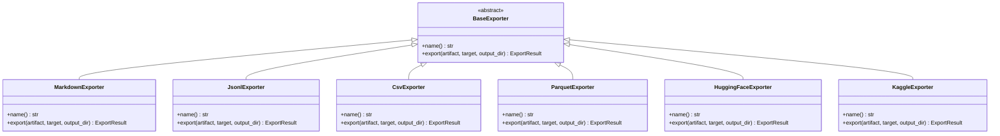
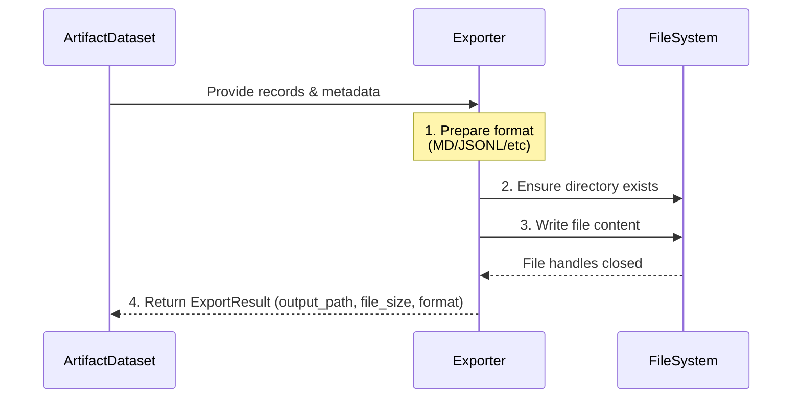
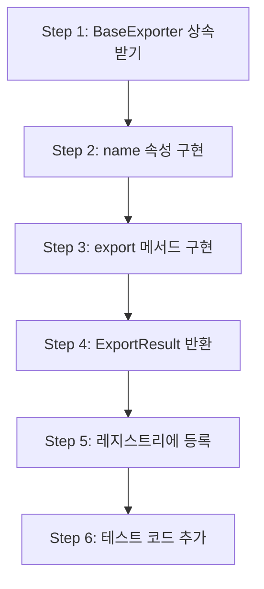
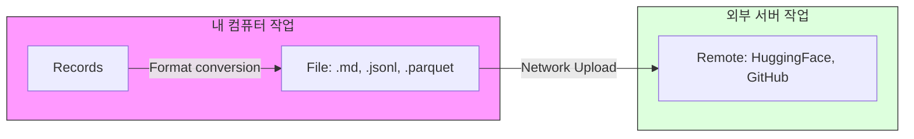

# 내보내기 모델 — KPubData Builder

## 0. "Exporter란?" (초보자용 설명)

Exporter는 **"데이터 변환기"**입니다.

KPubData Builder가 여러 곳에서 수집한 데이터는 컴퓨터의 메모리상에만 존재합니다. 이 데이터를 사용자가 실제로 파일로 읽으려면, 특정 형식(예: 메모장으로 볼 수 있는 Markdown, 엑셀과 비슷한 Parquet 등)에 맞춰 파일로 써주어야 합니다. 이 역할을 담당하는 것이 Exporter입니다.

## 1. 철학

Exporter는 표준 산출물 모델을 입력으로 받아 구체적인 파일 또는 게시 가능한 레이아웃을 만든다.



이들은 소스 데이터를 직접 가져오면 안 된다. (데이터를 직접 API에서 가져오지 않고, 이미 준비된 `ArtifactDataset`만을 사용하여 파일을 만든다.)



## 2. 표준 내보내기 입력(Exporter가 받는 재료)

모든 exporter는 다음을 입력으로 받는다:
- artifact records (실제 데이터 내용)
- metadata (작성자, 생성일 등 부가 정보)
- provenance (이 데이터가 어디서 왔는지에 대한 정보)
- schema summary (데이터 항목들의 이름과 타입)
- optional statistics (건수, 평균 등 통계)

## 3. 내장 Exporter(기본 제공 변환기)

다음 exporter는 `kpubdata_builder.exporters`에 내장되어 별도 설치 없이 사용할 수 있습니다.

### 3.1 Markdown (`kind: markdown`)
- **출력 형태:** 사람이 읽기 좋은 문서 형식 (`.md`)
- **포함 내용:** 데이터셋 설명, 항목별 설명 테이블, 샘플 데이터 행, 출처 정보 섹션
- **예시:**
  ```markdown
  # 2025년 날씨 보고서
  본 데이터셋은 기상청 API를 통해 생성되었습니다.
  | 날짜 | 기온 | 날씨 |
  | --- | --- | --- |
  | 2025-04-01 | 15도 | 맑음 |
  ```

### 3.2 JSONL (`kind: jsonl`)
- **출력 형태:** 한 줄에 하나씩 JSON 객체가 들어있는 텍스트 파일 (`.jsonl`)
- **특징:** 개발자들이 데이터를 한 줄씩 읽어서 처리하기에 매우 편리합니다.
- **예시:**
  ```json
  {"date": "2025-04-01", "temp": 15, "sky": "sunny"}
  {"date": "2025-04-01", "temp": 16, "sky": "cloudy"}
  ```

### 3.3 CSV (`kind: csv`)
- **출력 형태:** 쉼표로 구분된 표 형식 텍스트 파일 (`.csv`)
- **특징:** 스프레드시트나 데이터 분석 도구에서 널리 지원됩니다.

### 3.4 Parquet (`kind: parquet`)
- **출력 형태:** 대용량 데이터 처리에 최적화된 이진(Binary) 파일 (`.parquet`)
- **특징:** 용량이 매우 작고 읽는 속도가 매우 빠릅니다. (일반 텍스트 편집기로는 읽을 수 없습니다.)

### 3.5 Hugging Face Layout (`kind: huggingface`)
- **출력 형태:** AI 모델 공유 사이트인 Hugging Face에 올리기 좋은 파일 구조
- **포함 내용:** `data/` 폴더 내의 데이터 파일, `README.md` (Dataset Card), 설정 메타데이터

### 3.6 Kaggle (`kind: kaggle`)
- **출력 형태:** Kaggle Dataset에 맞는 파일 구조 및 메타데이터

## 4. 새 Exporter 만들기(단계별 튜토리얼)

새로운 형식(예: XML)으로 데이터를 저장하고 싶다면 다음 순서대로 코드를 작성하면 됩니다.



### Step 1: BaseExporter 상속받기
`exporters/base.py`에 정의된 `BaseExporter` 클래스를 상속받는 새로운 클래스를 만듭니다.

### Step 2: `name` 속성과 `export` 메서드 구현

`export` 메서드 시그니처는 정확히 다음과 같아야 합니다.

```python
# exporters/xml.py 예시 (작성 방법)
from pathlib import Path
from .base import BaseExporter, ExportResult, ensure_output_dir
from ..artifact import ArtifactDataset
from ..spec import ExportTarget

class XmlExporter(BaseExporter):
    @property
    def name(self) -> str:
        return "xml"

    def export(
        self,
        artifact: ArtifactDataset,
        target: ExportTarget,
        output_dir: Path,
    ) -> ExportResult:
        # 1. 안전한 출력 경로 준비 (PathTraversalError 방지 포함)
        out_file = ensure_output_dir(output_dir, target.output_path)

        # 2. 파일 쓰기
        out_file.write_text("<data/>", encoding="utf-8")

        # 3. ExportResult 반환
        return ExportResult(
            output_path=out_file,
            file_size=out_file.stat().st_size,
            format=self.name,
        )
```

### Step 3: 레지스트리에 등록

```python
from kpubdata_builder.exporters import register_exporter
from my_package.exporters.xml import XmlExporter

register_exporter(XmlExporter())
```

또는 `pyproject.toml`의 entry point 그룹 `kpubdata_builder.exporters`에 선언하여 플러그인으로 등록할 수도 있습니다.
단, entry point 선언만으로는 자동 로드되지 않습니다. 보안과 결정론적 실행을 위해 런타임에
`load_entry_point_exporters()`를 명시적으로 호출해야 레지스트리에 등록됩니다.

```python
from kpubdata_builder.exporters import load_entry_point_exporters

# 애플리케이션 시작 시 한 번 호출하여 플러그인 exporter를 레지스트리에 등록
load_entry_point_exporters()
```

## 5. Publisher vs Exporter (출판사 vs 배달부)

많은 분들이 헷갈려하는 두 개념의 차이점입니다.



| 구분 | Exporter (변환기) | Publisher (배달부) |
| :--- | :--- | :--- |
| **하는 일** | 데이터를 특정 형식의 **파일로 만듦** | 만들어진 파일을 어딘가로 **보냄/업로드** |
| **실행 위치** | 내 컴퓨터 (Local) | 인터넷 망을 통해 외부 서버로 전송 |
| **결과물** | `.md`, `.jsonl`, `.parquet` 등 파일 | Hugging Face 저장소, GitHub 저장소 등의 URL |
| **비유** | 요리를 완성해서 용기에 담기 | 포장된 요리를 손님 집으로 배달하기 |

---

## 관련 문서

### 이 저장소 내 문서
| 문서 | 설명 |
| :--- | :--- |
| [DOMAIN_MODEL.md](./DOMAIN_MODEL.md) | 도메인 모델 정의 |
| [ARCHITECTURE.md](./ARCHITECTURE.md) | 시스템 아키텍처 설계 |
| [API_CONTRACT.md](./API_CONTRACT.md) | API 인터페이스 규약 |
