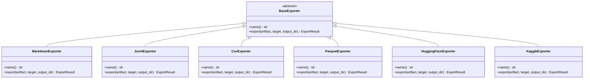
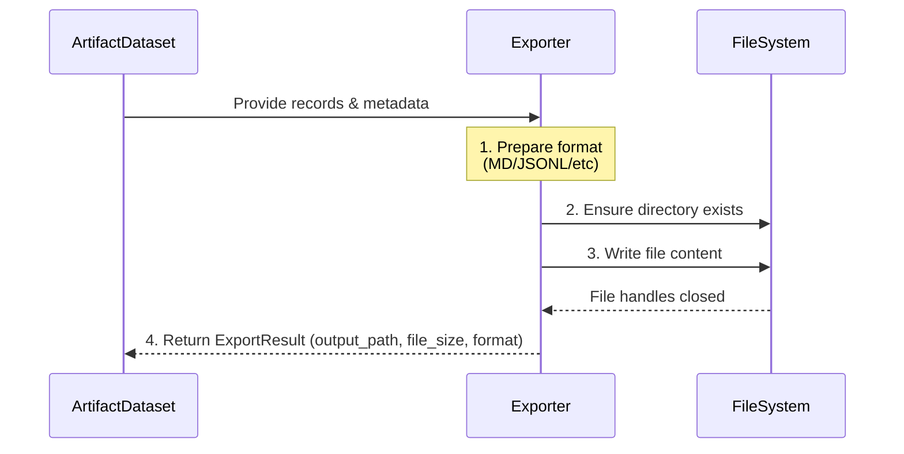
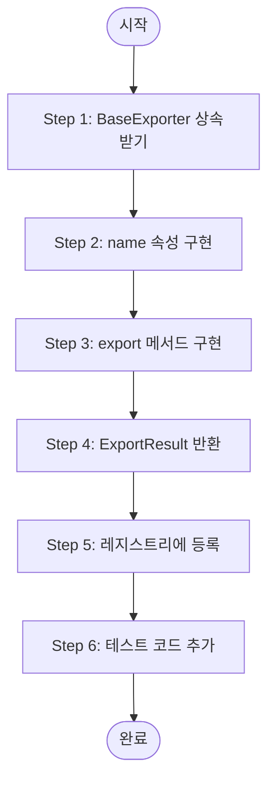
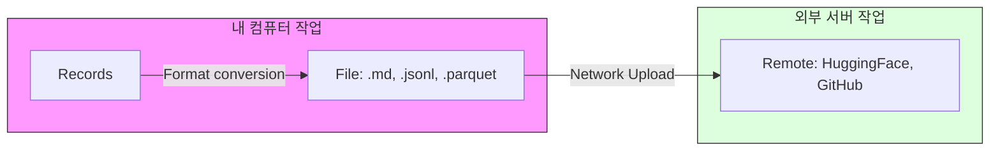

# 내보내기 모델 — KPubData Builder

## 0. "Exporter란?" (초보자용 설명)

Exporter는 **"데이터 변환기"**입니다.

KPubData Builder가 여러 곳에서 수집한 데이터는 컴퓨터의 메모리상에만 존재합니다. 이 데이터를 사용자가 실제로 파일로 읽으려면, 특정 형식(예: 메모장으로 볼 수 있는 Markdown, 엑셀과 비슷한 Parquet 등)에 맞춰 파일로 써주어야 합니다. 이 역할을 담당하는 것이 Exporter입니다.

## 1. 철학

Exporter는 표준 산출물 모델을 입력으로 받아 구체적인 파일 또는 게시 가능한 레이아웃을 만든다.


```mermaid
classDiagram
    class BaseExporter {
        <<abstract>>
        +name() str
        +export(artifact, target, output_dir) ExportResult
    }
    class MarkdownExporter {
        +name() str
        +export(artifact, target, output_dir) ExportResult
    }
    class JsonlExporter {
        +name() str
        +export(artifact, target, output_dir) ExportResult
    }
    class CsvExporter {
        +name() str
        +export(artifact, target, output_dir) ExportResult
    }
    class ParquetExporter {
        +name() str
        +export(artifact, target, output_dir) ExportResult
    }
    class HuggingFaceExporter {
        +name() str
        +export(artifact, target, output_dir) ExportResult
    }
    class KaggleExporter {
        +name() str
        +export(artifact, target, output_dir) ExportResult
    }

    BaseExporter <|-- MarkdownExporter
    BaseExporter <|-- JsonlExporter
    BaseExporter <|-- CsvExporter
    BaseExporter <|-- ParquetExporter
    BaseExporter <|-- HuggingFaceExporter
    BaseExporter <|-- KaggleExporter
```

이들은 소스 데이터를 직접 가져오면 안 된다. (데이터를 직접 API에서 가져오지 않고, 이미 준비된 `ArtifactDataset`만을 사용하여 파일을 만든다.)


```mermaid
sequenceDiagram
    participant AD as ArtifactDataset
    participant E as Exporter
    participant FS as FileSystem

    AD->>E: Provide records & metadata
    Note over E: 1. Prepare format<br/>(MD/JSONL/etc)
    E->>FS: 2. Ensure directory exists
    E->>FS: 3. Write file content
    FS-->>E: File handles closed
    E-->>AD: 4. Return ExportResult (output_path, file_size, format)
```

## 2. 표준 내보내기 입력(Exporter가 받는 재료)

모든 exporter는 다음을 입력으로 받는다:
- artifact records (실제 데이터 내용)
- metadata (작성자, 생성일 등 부가 정보)
- provenance (이 데이터가 어디서 왔는지에 대한 정보)
- schema summary (데이터 항목들의 이름과 타입)
- optional statistics (건수, 평균 등 통계)

## 3. 내장 Exporter(기본 제공 변환기)

다음 exporter는 `kpubdata_builder.exporters`에 내장되어 별도 설치 없이 사용할 수 있습니다.

### 3.1 Markdown (`kind: markdown`)
- **출력 형태:** 사람이 읽기 좋은 문서 형식 (`.md`)
- **포함 내용:** 데이터셋 설명, 항목별 설명 테이블, 샘플 데이터 행, 출처 정보 섹션
- **예시:**
  ```markdown
  # 2025년 날씨 보고서
  본 데이터셋은 기상청 API를 통해 생성되었습니다.
  | 날짜 | 기온 | 날씨 |
  | --- | --- | --- |
  | 2025-04-01 | 15도 | 맑음 |
  ```

### 3.2 JSONL (`kind: jsonl`)
- **출력 형태:** 한 줄에 하나씩 JSON 객체가 들어있는 텍스트 파일 (`.jsonl`)
- **특징:** 개발자들이 데이터를 한 줄씩 읽어서 처리하기에 매우 편리합니다.
- **예시:**
  ```json
  {"date": "2025-04-01", "temp": 15, "sky": "sunny"}
  {"date": "2025-04-01", "temp": 16, "sky": "cloudy"}
  ```

### 3.3 CSV (`kind: csv`)
- **출력 형태:** 쉼표로 구분된 표 형식 텍스트 파일 (`.csv`)
- **특징:** 스프레드시트나 데이터 분석 도구에서 널리 지원됩니다.

### 3.4 Parquet (`kind: parquet`)
- **출력 형태:** 대용량 데이터 처리에 최적화된 이진(Binary) 파일 (`.parquet`)
- **특징:** 용량이 매우 작고 읽는 속도가 매우 빠릅니다. (일반 텍스트 편집기로는 읽을 수 없습니다.)

### 3.5 Hugging Face Layout (`kind: huggingface`)
- **출력 형태:** AI 모델 공유 사이트인 Hugging Face에 올리기 좋은 파일 구조
- **포함 내용:** `data/` 폴더 내의 데이터 파일, `README.md` (Dataset Card), 설정 메타데이터

### 3.6 Kaggle (`kind: kaggle`)
- **출력 형태:** Kaggle Dataset에 맞는 파일 구조 및 메타데이터

## 4. 새 Exporter 만들기(단계별 튜토리얼)

새로운 형식(예: XML)으로 데이터를 저장하고 싶다면 다음 순서대로 코드를 작성하면 됩니다.


```mermaid
flowchart TD
    Start([시작]) --> S1[Step 1: BaseExporter 상속받기]
    S1 --> S2[Step 2: name 속성 구현]
    S2 --> S3[Step 3: export 메서드 구현]
    S3 --> S4[Step 4: ExportResult 반환]
    S4 --> S5[Step 5: 레지스트리에 등록]
    S5 --> S6[Step 6: 테스트 코드 추가]
    S6 --> End([완료])
```

### Step 1: BaseExporter 상속받기
`exporters/base.py`에 정의된 `BaseExporter` 클래스를 상속받는 새로운 클래스를 만듭니다.

### Step 2: `name` 속성과 `export` 메서드 구현

`export` 메서드 시그니처는 정확히 다음과 같아야 합니다.

```python
# exporters/xml.py 예시 (작성 방법)
from pathlib import Path
from .base import BaseExporter, ExportResult, ensure_output_dir
from ..artifact import ArtifactDataset
from ..spec import ExportTarget

class XmlExporter(BaseExporter):
    @property
    def name(self) -> str:
        return "xml"

    def export(
        self,
        artifact: ArtifactDataset,
        target: ExportTarget,
        output_dir: Path,
    ) -> ExportResult:
        # 1. 안전한 출력 경로 준비 (PathTraversalError 방지 포함)
        out_file = ensure_output_dir(output_dir, target.output_path)

        # 2. 파일 쓰기
        out_file.write_text("<data/>", encoding="utf-8")

        # 3. ExportResult 반환
        return ExportResult(
            output_path=out_file,
            file_size=out_file.stat().st_size,
            format=self.name,
        )
```

### Step 3: 레지스트리에 등록

```python
from kpubdata_builder.exporters import register_exporter
from my_package.exporters.xml import XmlExporter

register_exporter(XmlExporter())
```

또는 `pyproject.toml`의 entry point 그룹 `kpubdata_builder.exporters`에 선언하여 플러그인으로 등록할 수도 있습니다.
단, entry point 선언만으로는 자동 로드되지 않습니다. 보안과 결정론적 실행을 위해 런타임에
`load_entry_point_exporters()`를 명시적으로 호출해야 레지스트리에 등록됩니다.

```python
from kpubdata_builder.exporters import load_entry_point_exporters

# 애플리케이션 시작 시 한 번 호출하여 플러그인 exporter를 레지스트리에 등록
load_entry_point_exporters()
```

## 5. Publisher vs Exporter (출판사 vs 배달부)

많은 분들이 헷갈려하는 두 개념의 차이점입니다.


```mermaid
graph LR
    subgraph Exporter [내 컴퓨터 작업]
        D[Records] -- "Format conversion" --> F[File: .md, .jsonl, .parquet]
    end

    subgraph Publisher [외부 서버 작업]
        F -- "Network Upload" --> R[Remote: HuggingFace, GitHub]
    end
    
    style Exporter fill:#f9f,stroke:#333
    style Publisher fill:#dfd,stroke:#333
```

| 구분 | Exporter (변환기) | Publisher (배달부) |
| :--- | :--- | :--- |
| **하는 일** | 데이터를 특정 형식의 **파일로 만듦** | 만들어진 파일을 어딘가로 **보냄/업로드** |
| **실행 위치** | 내 컴퓨터 (Local) | 인터넷 망을 통해 외부 서버로 전송 |
| **결과물** | `.md`, `.jsonl`, `.parquet` 등 파일 | Hugging Face 저장소, GitHub 저장소 등의 URL |
| **비유** | 요리를 완성해서 용기에 담기 | 포장된 요리를 손님 집으로 배달하기 |

---

## Exporter 계약 (ADR 0004)

이 절은 exporter 구현이 따라야 할 안정 계약을 정의한다. ADR 0004(#310)에 따라
등록/발견 메커니즘, `export()` 시그니처, 실패 시맨틱을 명문화한다.

### 6.1 등록 계약

Exporter는 **명시적 레지스트리**에 등록된다. 등록은 두 가지 방식으로 가능하다:

**방식 A: Factory 등록 (권고, ADR 0004)**
```python
from kpubdata_builder.exporters import register_exporter_factory
from my_exporter import MyExporter

register_exporter_factory("myformat", MyExporter)
```
- Factory는 인자 없이 호출할 때마다 **새 인스턴스**를 반환해야 한다.
- 같은 kind 재등록 시 `ValueError` 발생 (명시적 오류).
- 덮어쓰기는 `override=True` 옵션으로만 허용된다.

**방식 B: 인스턴스 등록 (레거시 호환)**
```python
from kpubdata_builder.exporters import register_exporter
from my_exporter import MyExporter

register_exporter(MyExporter())
```

**방식 C: Entry Points (자동 발견)**
```python
# pyproject.toml
[project.entry-points."kpubdata_builder.exporters"]
myformat = "my_package:MyExporter"

# 런타임
from kpubdata_builder.exporters import load_entry_point_exporters
load_entry_point_exporters()
```

### 6.2 `export()` 메서드 계약

#### 시그니처
```python
def export(
    self,
    artifact: ArtifactDataset,  # 표준 데이터셋 산출물
    target: ExportTarget,        # kind, output_path, 옵션
    output_dir: Path,            # 기본 출력 디렉터리
) -> ExportResult:
    ...
```

#### 입력
- `artifact`: `ArtifactDataset` — 표준화된 레코드·메타데이터·출처·스키마 요약
- `target`: `ExportTarget` — exporter kind, 출력 상대 경로, exporter별 옵션
- `output_dir`: `Path` — 모든 출력의 기준 디렉터리 (경로 안전 모듈이 보장)

#### 반환
- `ExportResult` — 생성된 파일 메타데이터:
  - `output_path`: 생성된 파일의 절대 경로
  - `file_size`: 바이트 단위 파일 크기
  - `format`: exporter 식별자

### 6.3 실패 및 부분출력 계약

#### 예외 규약
Exporter는 실패 시 **예외를 발생**시킨다. 모든 I/O 오류는 `ExportError`로 래핑되어야 한다.

```python
from ..errors import ExportError

try:
    # 파일 쓰기 등 I/O 작업
except OSError as exc:
    raise ExportError(f"Failed to export: {exc}") from exc
```

#### 부분출력 금지 (원자성)
Exporter는 **"전부 성공하거나 전부 실패"** 원칙을 따른다:
- 성공 시: 모든 파일이 정상적으로 기록되고 `ExportResult`를 반환
- 실패 시: 아무런 파일도 기록되지 않은 상태 (또는 명시적 부분 표기)

임시 파일(`.tmp`)을 사용한 atomic write 패턴을 권장한다:

```python
import tempfile
import os
from contextlib import suppress

def export(self, artifact, target, output_dir) -> ExportResult:
    destination = ensure_output_dir(output_dir, target.output_path)
    content = self._format(artifact)  # 가상의 포맷팅 메서드

    fd, tmp_name = tempfile.mkstemp(dir=destination.parent, suffix=".tmp")
    try:
        with os.fdopen(fd, "w", encoding="utf-8") as f:
            f.write(content)
        os.replace(tmp_name, destination)  # atomic
    except BaseException:
        with suppress(OSError):
            os.unlink(tmp_name)  # 실패 시 임시 파일 삭제
        raise ExportError(f"Failed to write {destination}")
```

#### 명시적 부분출력 허용 (선택)
일부 exporter는 의도적으로 부분출력을 제공할 수 있다 (예: 대용량 데이터 처리).
이 경우 **명시적으로 partial 표기를 해야 한다**. 현재 구현에서는 미사용.

### 6.4 경로 안전 계약

Exporter는 `output_dir` 밖으로 파일을 쓸 수 없다:
- `ensure_output_dir()` 헬퍼를 사용하여 경로 안전을 보장받아야 한다 (#210).
- 악의적 `output_path` (예: `../../../etc/passwd`)는 `PathTraversalError`로 거부된다.

```python
from .base import ensure_output_dir

def export(self, artifact, target, output_dir) -> ExportResult:
    # safe_output_path가 output_dir 밖으로 나가는지 검사
    destination = ensure_output_dir(output_dir, target.output_path)
    ...
```

---

## 관련 문서

### 이 저장소 내 문서
| 문서 | 설명 |
| :--- | :--- |
| [DOMAIN_MODEL.md](./DOMAIN_MODEL.md) | 도메인 모델 정의 |
| [ARCHITECTURE.md](./ARCHITECTURE.md) | 시스템 아키텍처 설계 |
| [API_CONTRACT.md](./API_CONTRACT.md) | API 인터페이스 규약 |
| [AGENTS.md](./AGENTS.md) | 골든 테스트 요구 및 개발 체크리스트 |

### 상위 ADR
| ADR | 제목 | 상태 |
| :--- | :--- | :--- |
| [ADR 0004](./adrs/0004-plugin-exporter-contract.md) | Plugin Exporter API 계약 안정화 | 승인됨 |
