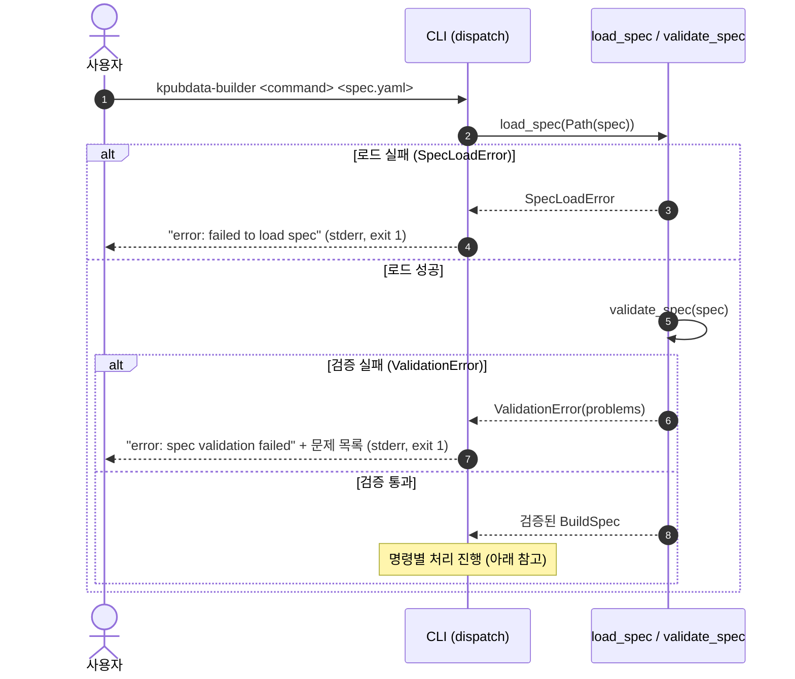
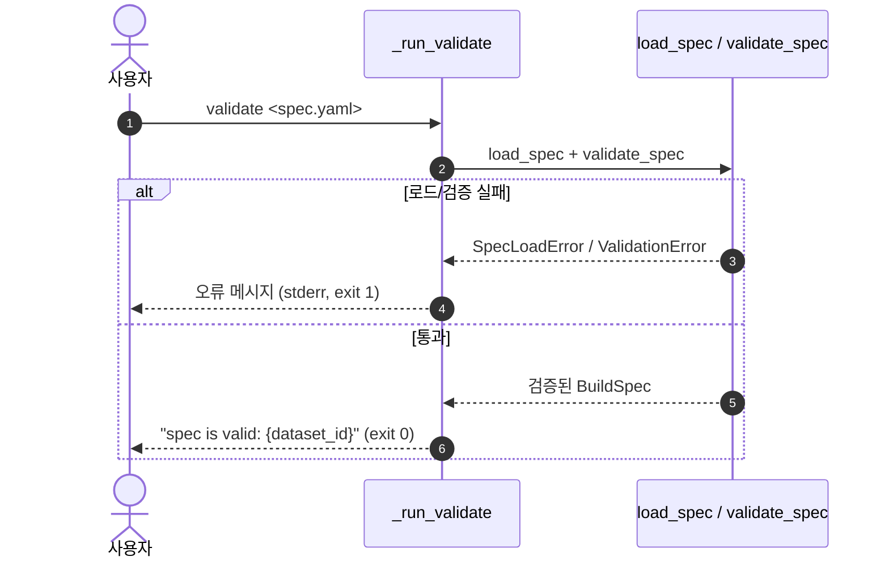
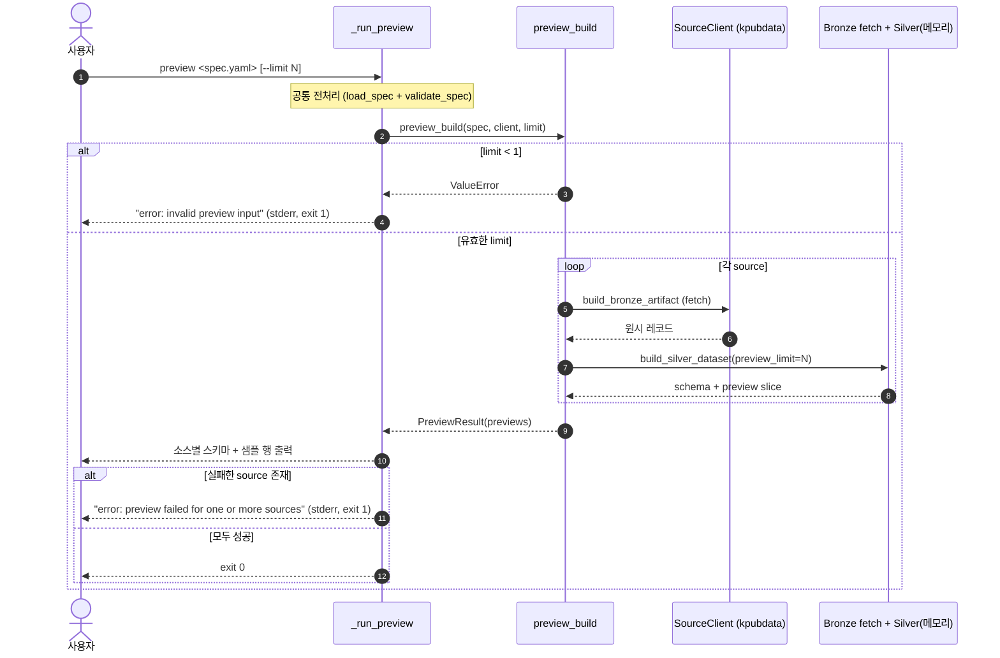
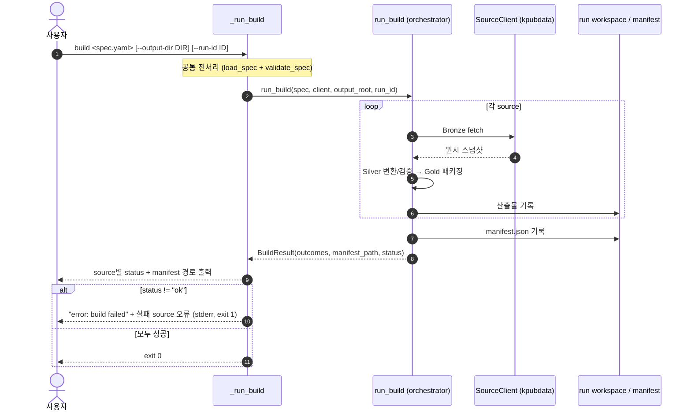
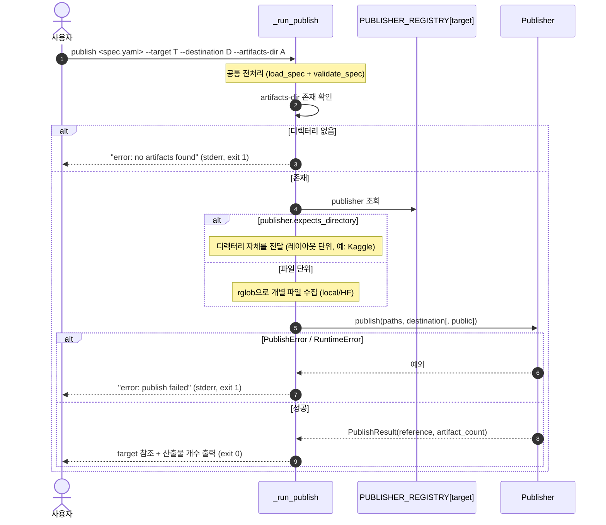
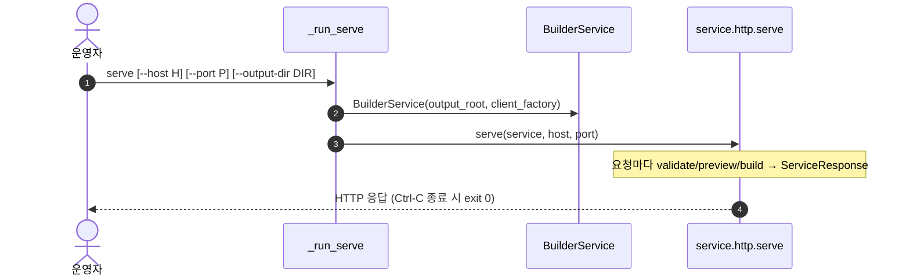

# 기능 처리 흐름 (기능처리도) — KPubData Builder

이 문서는 KPubData Builder의 **기능처리도(機能處理圖)**입니다. 각 기능(CLI 하위 명령)이 요청을 받아 어떤 순서로 내부 컴포넌트를 호출하고, 성공/실패를 어떻게 결정하는지 **기능 단위 시퀀스 다이어그램**으로 정리합니다.

- **알고리즘 관점**(단계별 처리 순서·검증 게이트·상태 전이)은 [ALGORITHM.md](./ALGORITHM.md)를 참고하세요.
- **데이터 흐름 관점**(Bronze→Silver→Gold 승격)은 [ARCHITECTURE.md](./ARCHITECTURE.md)를 참고하세요.
- 기준 구현은 `kpubdata_builder.cli`와 `kpubdata_builder.pipeline`입니다. **코드와 문서가 어긋나면 코드가 정답입니다.**

## 0. 공통 처리 규약

모든 기능은 아래 공통 전처리를 거칩니다. 이 단계 중 하나라도 실패하면 즉시 `stderr` 출력 후 종료 코드 `1`로 **빠르게 실패(fail-fast)**합니다.

- `_create_client()`는 `kpubdata.Client.from_env()`로 소스 클라이언트를 만듭니다. **실제 네트워크 호출은 preview/build 실행 시점에만** 발생합니다(validate는 네트워크 없음).

## 1. validate — 명세 검증

BuildSpec YAML을 로드·검증만 수행합니다. 네트워크 호출도, 산출물 기록도 없습니다.

## 2. preview — 스키마·샘플 미리보기

각 소스를 fetch하여 메모리상에서 Silver까지 구성하고, **스키마와 샘플 행만** 출력합니다. 어떤 산출물 파일도 기록하지 않습니다(`preview_build`, `pipeline/preview.py`).

- 개별 소스 fetch 실패는 예외로 던지지 않고 `SourcePreview(status="failed")`로 수집됩니다. 하나라도 실패하면 CLI가 `stderr` + exit 1로 변환하여 CI/자동화가 성공으로 오판하지 않도록 합니다.

## 3. build — Medallion 파이프라인 실행

BuildSpec을 Bronze→Silver→Gold로 승격시키고 산출물과 manifest를 기록합니다(`run_build`, `pipeline/orchestrator.py`). 단계별 상세는 [ALGORITHM.md](./ALGORITHM.md) 참고.

## 4. publish — 산출물 게시

이미 만들어진 산출물 디렉터리를 지정한 target(local/huggingface/kaggle 등)으로 게시합니다. 빌드를 재실행하지 않고 `--artifacts-dir`의 파일을 전송합니다(`PUBLISHER_REGISTRY`).

- `--public`은 kaggle target에만 적용되며, 다른 target에서는 무시됩니다.
- publisher별 입력 계약(디렉터리 vs 파일) 불일치는 `expects_directory` 플래그로 해소합니다.

## 5. serve — HTTP 서비스 (참고)

`BuilderService`를 HTTP 서버로 노출합니다. Studio 등 상위 계층은 CLI 대신 이 서비스의 `validate`/`preview`/`build` 메서드를 호출합니다.

## 관련 문서

| 문서 | 관점 |
| :--- | :--- |
| [ALGORITHM.md](./ALGORITHM.md) | 빌드 알고리즘(처리 순서·검증 게이트·상태 전이) |
| [ARCHITECTURE.md](./ARCHITECTURE.md) | Medallion 단계 설계·레이어 분리 |
| [API_CONTRACT.md](./API_CONTRACT.md) | Builder Service/API 계약 |
| [EXPORT_MODEL.md](./EXPORT_MODEL.md) | Exporter 처리 흐름 |
| [BUILD_STATE.md](./BUILD_STATE.md) | 빌드 실행 상태 머신 |
