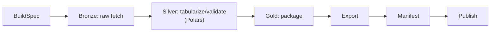

# KPubData Builder — Korea Public Data Builder

[](https://www.python.org/)
[](LICENSE)

**KPubData Builder**는 원시 공공데이터를 Medallion Architecture 기반으로 정제·검증·패키징하여 배포 가능한 데이터셋으로 만드는 **dataset build engine**입니다. `kpubdata`가 정규화한 레코드를 받아 Bronze/Silver/Gold 단계를 거쳐 결과물을 만들고, Manifest로 기록합니다.

---

## 소개

`kpubdata-builder`는 **원시 공공데이터를 정제된, 검증된, 배포 가능한 데이터셋으로 변환하는 빌드 엔진**입니다.

쉽게 말해:

- `kpubdata`는 데이터를 **가져오고 정규화하는 코어**입니다.
- `kpubdata-builder`는 그 데이터를 **BuildSpec에 따라 Bronze → Silver → Gold로 승격시키고 export/publish까지 연결하는 엔진**입니다.
- `kpubdata-studio`는 builder 위에 올라가는 **데이터셋 워크벤치 UI**입니다.

즉, Builder는 문서·데이터셋·배포 패키지 같은 결과물을 일관되게 만들어내는 파이프라인의 중심이며, **별도의 UI 제품이 아니라 실행 계층**입니다.

## 왜 필요한가

공공데이터를 가져오는 것만으로는 충분하지 않습니다. 실제 데이터셋 작업에는 다음이 필요합니다.

- **명세 기반 실행**: 사람이 임의 스크립트를 쓰지 않아도 같은 BuildSpec으로 같은 빌드를 다시 실행할 수 있어야 합니다.
- **산출물 생성**: Markdown, JSONL, Parquet, Hugging Face 레이아웃 같은 출력물을 같은 규칙으로 생성해야 합니다.
- **추적 가능성**: 어떤 spec으로 어떤 결과물이 만들어졌는지 Manifest로 남겨야 합니다.
- **배포 분리**: 파일을 만드는 단계와 외부 저장소로 보내는 단계를 구분해야 합니다.

## 핵심 개념 관계

| 개념 | 역할 | 입력 | 출력 | 소유 주체 |
| :--- | :--- | :--- | :--- | :--- |
| **BuildSpec** | 빌드 실행의 단일 계약(source of truth) | YAML/구조화된 spec | 검증된 실행 계획 | Builder |
| **Artifact** | 빌드가 만든 실제 파일/디렉터리 | Bronze/Silver/Gold 실행 결과 + export 설정 | `.md`, `.jsonl`, `.parquet`, 레이아웃 디렉터리 | Builder |
| **Polars** | Silver 단계의 단일 tabular engine | Bronze snapshot/정규화 레코드 | 검증 가능한 표 형태 데이터 | Builder 내부 엔진 |
| **Manifest** | 빌드 결과의 감사 기록 | spec digest, 상태, artifact 메타데이터 | `manifest.json` | Builder |
| **Exporter** | 레코드를 구체적 파일 형식으로 변환 | 레코드/메타데이터 | Artifact 집합 | Builder 플러그인 |
| **Publisher** | 생성된 artifact를 외부 대상으로 전송 | Artifact + publish 설정 | 게시 결과/원격 참조 | Builder 플러그인 |

## 빌드 흐름



```text
[BuildSpec] -> [Bronze: raw fetch] -> [Silver: tabularize/validate (Polars)] -> [Gold: package] -> [Export] -> [Manifest] -> [Publish]
```

## Medallion Architecture

Builder의 내부 파이프라인은 선형 ETL이 아니라 **Medallion Architecture**를 따릅니다.

- **Bronze**: `kpubdata`를 통해 원시 데이터를 가져오고 source snapshot과 provenance를 남깁니다.
- **Silver**: Bronze 산출물을 **Polars 단일 엔진**으로 tabularize하고, schema validation·통계 계산·preview 생성을 수행합니다.
- **Gold**: Silver 결과를 split-ready/export-ready 패키지로 조립해 exporter와 publisher가 소비할 수 있는 형태로 만듭니다.

실행 중간 산출물은 run workspace에 단계별로 분리됩니다.

```text
build/{run_id}/
├── bronze/
├── silver/
└── gold/
```

즉, Builder는 단순히 파일만 뽑는 도구가 아니라, Bronze/Silver/Gold 승격 규칙과 실행 기록을 일관되게 관리하는 오케스트레이터입니다.

## Builder와 Studio의 관계

`kpubdata-studio`는 Builder를 대체하는 별도 파이프라인 엔진이 아닙니다.

> **Studio는 builder 위에 올라가는 시각적 control surface이며, 별도의 pipeline engine이 아닙니다.**

따라서:

- BuildSpec 검증 로직은 Builder가 소유합니다.
- Preview 계산 로직은 Builder가 소유합니다.
- Manifest 스키마는 Builder가 소유합니다.
- Publish 실행은 Builder가 수행하고, Studio는 이를 요청합니다.

자세한 규칙은 [BOUNDARY.md](./BOUNDARY.md)를 참고하세요.

## 빠른 시작

> **의존성 설치 참고 (kpubdata 해석 전략):** 로컬 개발에서는 `../kpubdata` 형제 디렉터리를 editable checkout으로 사용하고, CI/배포에서는 `uv sync --no-sources`로 PyPI 릴리스를 설치합니다. 자세한 내용은 [CONTRIBUTING.md의 Step 3-1](./CONTRIBUTING.md#step-3-1-의존성-해석-전략-dependency-resolution-strategy)을 참고하세요.

### CLI 예시

```bash
# BuildSpec 검증
kpubdata-builder validate specs/weather.yaml

# 미리보기
kpubdata-builder preview specs/weather.yaml --limit 5

# 빌드 실행
kpubdata-builder build specs/weather.yaml --output-dir ./dist/weather
```

### Python API 예시

```python
from pathlib import Path
from kpubdata_builder.service import BuilderService

service = BuilderService(
    output_root=Path("./dist"),
    client_factory=lambda: my_kpubdata_client,
)
result = service.build(open("specs/weather.yaml").read())
```

### 최소 BuildSpec 예시

```yaml
dataset_id: weather-village-forecast
title: "동네예보 데이터셋"
description: "기상청 동네예보 서비스에서 수집한 기상 예보 데이터"

sources:
  - provider: datago
    dataset: village_fcst
    params:
      base_date: "20250401"
      nx: 55
      ny: 127

exports:
  - kind: markdown
    output_path: artifacts/weather_report.md
```

BuildSpec 계약은 [BUILD_SPEC.md](./BUILD_SPEC.md)를 참고하세요. Bronze/Silver/Gold stage는 현재 사용자 입력 필드가 아니라 Builder orchestrator가 내부적으로 관리하는 실행 단계입니다.

### End-to-end 예제

서울 아파트 실거래가를 `kpubdata`로 수집하고 Polars로 정제한 뒤 Hugging Face Dataset 형태의 로컬 산출물로 패키징하는 예제는 [docs/examples/seoul-apt-trade.md](./docs/examples/seoul-apt-trade.md)를 참고하세요.

## 주요 문서

| 문서 | 설명 |
| :--- | :--- |
| [ARCHITECTURE.md](./ARCHITECTURE.md) | Medallion stage 설계와 레이어 분리 |
| [BUILD_SPEC.md](./BUILD_SPEC.md) | BuildSpec 계약과 검증 규칙 |
| [API_CONTRACT.md](./API_CONTRACT.md) | Builder 중심 API/Service 계약 |
| [BUILD_STATE.md](./BUILD_STATE.md) | 빌드 실행 상태 머신 |
| [BOUNDARY.md](./BOUNDARY.md) | Builder-Studio 경계 규칙 |
| [ROADMAP.md](./ROADMAP.md) | 릴리스 단계별 계획 |

## KPubData Product Family

| 패키지 | 역할 |
| :--- | :--- |
| [kpubdata](https://github.com/yeongseon/kpubdata) | 공공데이터 접근·정규화 코어 + curated dataset collection 브랜드 |
| [kpubdata-builder](https://github.com/yeongseon/kpubdata-builder) | 원시 데이터 → 정제·검증·배포 가능한 데이터셋 빌드 엔진 |
| [kpubdata-studio](https://github.com/yeongseon/kpubdata-studio) | 데이터셋 워크벤치 UI (inspect, transform, preview, export) |
