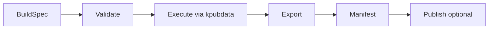

# KPubData Builder — Korea Public Data Builder

[](https://www.python.org/)
[](LICENSE)

**KPubData Builder**는 재현 가능한 공공데이터 데이터셋 조립을 위한 **execution engine**입니다. `kpubdata`가 정규화한 레코드를 받아, BuildSpec에 따라 검증하고, 조립하고, 내보내고, Manifest로 기록합니다.

---

## 소개

`kpubdata-builder`는 **재현 가능한 공공데이터 데이터셋 조립을 위한 실행 엔진**입니다.

쉽게 말해:

- `kpubdata`는 데이터를 **가져오고 정규화하는 코어**입니다.
- `kpubdata-builder`는 그 데이터를 **BuildSpec에 따라 실행 가능한 산출물로 조립하는 엔진**입니다.
- `kpubdata-studio`는 builder 위에 올라가는 **시각적 제어면(control surface)**입니다.

즉, Builder는 문서·데이터셋·배포 패키지 같은 결과물을 일관되게 만들어내는 파이프라인의 중심이며, **별도의 UI 제품이 아니라 실행 계층**입니다.

## 왜 필요한가

공공데이터를 가져오는 것만으로는 충분하지 않습니다. 실제 데이터셋 작업에는 다음이 필요합니다.

- **명세 기반 실행**: 사람이 임의 스크립트를 쓰지 않아도 같은 BuildSpec으로 같은 빌드를 다시 실행할 수 있어야 합니다.
- **산출물 생성**: Markdown, JSONL, Parquet, Hugging Face 레이아웃 같은 출력물을 같은 규칙으로 생성해야 합니다.
- **추적 가능성**: 어떤 spec으로 어떤 결과물이 만들어졌는지 Manifest로 남겨야 합니다.
- **배포 분리**: 파일을 만드는 단계와 외부 저장소로 보내는 단계를 구분해야 합니다.

## 핵심 개념 관계

| 개념 | 역할 | 입력 | 출력 | 소유 주체 |
| :--- | :--- | :--- | :--- | :--- |
| **BuildSpec** | 빌드 실행의 단일 계약(source of truth) | YAML/구조화된 spec | 검증된 실행 계획 | Builder |
| **Artifact** | 빌드가 만든 실제 파일/디렉터리 | 실행 결과 + export 설정 | `.md`, `.jsonl`, `.parquet`, 레이아웃 디렉터리 | Builder |
| **Manifest** | 빌드 결과의 감사 기록 | spec digest, 상태, artifact 메타데이터 | `manifest.json` | Builder |
| **Exporter** | 레코드를 구체적 파일 형식으로 변환 | 레코드/메타데이터 | Artifact 집합 | Builder 플러그인 |
| **Publisher** | 생성된 artifact를 외부 대상으로 전송 | Artifact + publish 설정 | 게시 결과/원격 참조 | Builder 플러그인 |

## 빌드 흐름



```text
[BuildSpec] -> [Validate] -> [Execute] -> [Export] -> [Manifest] -> [Publish(optional)]
```

## Builder와 Studio의 관계

`kpubdata-studio`는 Builder를 대체하는 별도 파이프라인 엔진이 아닙니다.

> **Studio는 builder 위에 올라가는 시각적 control surface이며, 별도의 pipeline engine이 아닙니다.**

따라서:

- BuildSpec 검증 로직은 Builder가 소유합니다.
- Preview 계산 로직은 Builder가 소유합니다.
- Manifest 스키마는 Builder가 소유합니다.
- Publish 실행은 Builder가 수행하고, Studio는 이를 요청합니다.

자세한 규칙은 [BOUNDARY.md](./BOUNDARY.md)를 참고하세요.

## 빠른 시작

### CLI 예시

```bash
# BuildSpec 검증
kpubdata-builder validate specs/weather.yaml

# 미리보기
kpubdata-builder preview specs/weather.yaml --limit 5

# 빌드 실행
kpubdata-builder build specs/weather.yaml --output-dir ./dist/weather
```

### 향후 API 예시(placeholder)

서비스 모드가 정식 도입되면 아래와 같은 형태의 API 사용 예시가 추가될 예정입니다.

```python
# Future API example placeholder
# from kpubdata_builder.service import BuilderService
# result = BuilderService().build_from_file("specs/weather.yaml")
```

### 최소 BuildSpec 예시

```yaml
version: "1"
dataset: weather-village-forecast

source:
  provider: datago
  dataset: village_fcst
  params:
    base_date: "20250401"
    nx: 55
    ny: 127

export:
  format: markdown

output:
  dir: ./dist/weather
```

BuildSpec 계약은 [BUILD_SPEC.md](./BUILD_SPEC.md)를 참고하세요.

## 주요 문서

| 문서 | 설명 |
| :--- | :--- |
| [ARCHITECTURE.md](./ARCHITECTURE.md) | BuildSpec 중심 설계와 레이어 분리 |
| [BUILD_SPEC.md](./BUILD_SPEC.md) | BuildSpec 계약과 검증 규칙 |
| [API_CONTRACT.md](./API_CONTRACT.md) | Builder 중심 API/Service 계약 |
| [BUILD_STATE.md](./BUILD_STATE.md) | 빌드 실행 상태 머신 |
| [BOUNDARY.md](./BOUNDARY.md) | Builder-Studio 경계 규칙 |
| [ROADMAP.md](./ROADMAP.md) | 릴리스 단계별 계획 |

## KPubData Product Family

| 패키지 | 역할 |
| :--- | :--- |
| [kpubdata](https://github.com/yeongseon/kpubdata) | 공공데이터 접근·정규화 코어 |
| [kpubdata-builder](https://github.com/yeongseon/kpubdata-builder) | 재현 가능한 데이터셋 조립 실행 엔진 |
| [kpubdata-studio](https://github.com/yeongseon/kpubdata-studio) | builder 위에서 동작하는 시각적 제어면 |
