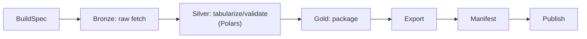

# KPubData Builder — Korea Public Data Builder

[](https://www.python.org/)
[](LICENSE)

**KPubData Builder**는 원시 공공데이터를 Medallion Architecture 기반으로 정제·검증·패키징하여 배포 가능한 데이터셋으로 만드는 **dataset build engine**입니다. `kpubdata`가 정규화한 레코드를 받아 Bronze/Silver/Gold 단계를 거쳐 결과물을 만들고, Manifest로 기록합니다.

---

## 소개

`kpubdata-builder`는 **원시 공공데이터를 정제된, 검증된, 배포 가능한 데이터셋으로 변환하는 빌드 엔진**입니다.

쉽게 말해:

- `kpubdata`는 데이터를 **가져오고 정규화하는 코어**입니다.
- `kpubdata-builder`는 그 데이터를 **BuildSpec에 따라 Bronze → Silver → Gold로 승격시키고 export/publish까지 연결하는 엔진**입니다.
- `kpubdata-studio`는 builder 위에 올라가는 **데이터셋 워크벤치 UI**입니다.

즉, Builder는 문서·데이터셋·배포 패키지 같은 결과물을 일관되게 만들어내는 파이프라인의 중심이며, **별도의 UI 제품이 아니라 실행 계층**입니다.

## 왜 필요한가

공공데이터를 가져오는 것만으로는 충분하지 않습니다. 실제 데이터셋 작업에는 다음이 필요합니다.

- **명세 기반 실행**: 사람이 임의 스크립트를 쓰지 않아도 같은 BuildSpec으로 같은 빌드를 다시 실행할 수 있어야 합니다.
- **산출물 생성**: Markdown, JSONL, Parquet, Hugging Face 레이아웃 같은 출력물을 같은 규칙으로 생성해야 합니다.
- **추적 가능성**: 어떤 spec으로 어떤 결과물이 만들어졌는지 Manifest로 남겨야 합니다.
- **배포 분리**: 파일을 만드는 단계와 외부 저장소로 보내는 단계를 구분해야 합니다.

## 핵심 개념 관계

| 개념 | 역할 | 입력 | 출력 | 소유 주체 |
| :--- | :--- | :--- | :--- | :--- |
| **BuildSpec** | 빌드 실행의 단일 계약(source of truth) | YAML/구조화된 spec | 검증된 실행 계획 | Builder |
| **Artifact** | 빌드가 만든 실제 파일/디렉터리 | Bronze/Silver/Gold 실행 결과 + export 설정 | `.md`, `.jsonl`, `.parquet`, 레이아웃 디렉터리 | Builder |
| **Polars** | Silver 단계의 단일 tabular engine | Bronze snapshot/정규화 레코드 | 검증 가능한 표 형태 데이터 | Builder 내부 엔진 |
| **Manifest** | 빌드 결과의 감사 기록 | spec digest, 상태, artifact 메타데이터 | `manifest.json` | Builder |
| **Exporter** | 레코드를 구체적 파일 형식으로 변환 | 레코드/메타데이터 | Artifact 집합 | Builder 플러그인 |
| **Publisher** | 생성된 artifact를 외부 대상으로 전송 | Artifact + publish 설정 | 게시 결과/원격 참조 | Builder 플러그인 |

## 빌드 흐름


```mermaid
flowchart LR
    BS[BuildSpec] --> B[Bronze: raw fetch]
    B --> S["Silver: tabularize/validate<br/>(Polars)"]
    S --> G[Gold: package]
    G --> E[Export]
    E --> M[Manifest]
    M --> P[Publish]
```

```text
[BuildSpec] -> [Bronze: raw fetch] -> [Silver: tabularize/validate (Polars)] -> [Gold: package] -> [Export] -> [Manifest] -> [Publish]
```

## Medallion Architecture

Builder의 내부 파이프라인은 선형 ETL이 아니라 **Medallion Architecture**를 따릅니다.

- **Bronze**: `kpubdata`를 통해 원시 데이터를 가져오고 source snapshot과 provenance를 남깁니다.
- **Silver**: Bronze 산출물을 **Polars 단일 엔진**으로 tabularize하고, schema validation·통계 계산·preview 생성을 수행합니다.
- **Gold**: Silver 결과를 split-ready/export-ready 패키지로 조립해 exporter와 publisher가 소비할 수 있는 형태로 만듭니다.

실행 중간 산출물은 run workspace에 단계별로 분리됩니다.

```text
build/{run_id}/
├── bronze/
├── silver/
└── gold/
```

즉, Builder는 단순히 파일만 뽑는 도구가 아니라, Bronze/Silver/Gold 승격 규칙과 실행 기록을 일관되게 관리하는 오케스트레이터입니다.

## Builder와 Studio의 관계

`kpubdata-studio`는 Builder를 대체하는 별도 파이프라인 엔진이 아닙니다.

> **Studio는 builder 위에 올라가는 시각적 control surface이며, 별도의 pipeline engine이 아닙니다.**

따라서:

- BuildSpec 검증 로직은 Builder가 소유합니다.
- Preview 계산 로직은 Builder가 소유합니다.
- Manifest 스키마는 Builder가 소유합니다.
- Publish 실행은 Builder가 수행하고, Studio는 이를 요청합니다.

자세한 규칙은 [BOUNDARY.md](./BOUNDARY.md)를 참고하세요.

## 배포 및 설정 가이드

### 환경변수

| 변수명 | 설명 | 기본값 | 필수 여부 |
| :--- | :--- | :--- | :--- |
| `KPUBDATA_BUILDER_API_KEY` | API 인증 키 (`X-API-Key` 헤더). 미설정 시 모든 요청 401 (fail-closed) | 없음 | **필수** (프로덕션) |
| `KPUBDATA_BUILDER_DEV_MODE` | `true`/`1`이면 인증 생략 (**로컬 개발 전용**, ADR 0006) | 미설정 | 선택 |
| `KPUBDATA_BUILDER_ALLOWED_ORIGINS` | CORS 허용 오리진 (콤마 구분, default-deny) | 미설정 | 선택 |
| `KPUBDATA_BUILDER_CREDENTIAL_MASTER_KEY` | 사용자별 Provider credential AES-GCM master key (URL-safe base64 32 bytes) | 미설정 | credential CRUD 사용 시 필수 |
| `KPUBDATA_BUILDER_PROVIDER_TEST_TIMEOUT` | Provider connection test 전송 timeout(초) | `10` | 선택 |
| `KPUBDATA_BUILDER_CANCELLED_RUN_TTL_HOURS` | `prune-cancelled --apply`가 cancelled partial run을 정리하기까지의 보존 시간(시간). 미설정이면 정리 대상 없음(#549) | 미설정 | 선택 |
| `KPUBDATA_BUILDER_LOCAL_PUBLISH_ROOT` | HTTP `local` publish target의 루트 디렉터리(절대 경로). destination은 이 안의 상대 `owner/name`로 한정된다(#550). 미설정이면 local target blocker | 미설정 | local publish 사용 시 필수 |

> **fail-closed (ADR 0006)**: `KPUBDATA_BUILDER_API_KEY` 미설정 + `DEV_MODE` 미설정 → 모든 요청 401.
> 로컬 개발에서 인증 없이 띄우려면 `KPUBDATA_BUILDER_DEV_MODE=1`을 명시하세요.
> Docker 컨테이너는 `DEV_MODE` 없이 `API_KEY`가 없으면 기동 자체를 거부합니다 (`docker-entrypoint.sh`).

### CLI 인자

#### 전역 인자

| 인자 | 설명 | 기본값 |
| :--- | :--- | :--- |
| `--version` | 버전 정보 표시 | - |

#### validate 명령

BuildSpec YAML 파일의 유효성을 검사합니다.

| 인자 | 설명 | 필수 여부 |
| :--- | :--- | :--- |
| `spec` | BuildSpec YAML 파일 경로 | 필수 |

```bash
kpubdata-builder validate specs/weather.yaml
```

#### preview 명령

BuildSpec을 실행하지 않고 스키마와 샘플 데이터만 미리볼 수 있습니다.

| 인자 | 설명 | 기본값 | 필수 여부 |
| :--- | :--- | :--- | :--- |
| `spec` | BuildSpec YAML 파일 경로 | - | 필수 |
| `--limit` | 소스별 샘플 최대 행 수 | 5 | 선택 |

```bash
kpubdata-builder preview specs/weather.yaml --limit 10
```

#### build 명령

BuildSpec을 통해 Medallion 파이프라인을 실행합니다.

| 인자 | 설명 | 기본값 | 필수 여부 |
| :--- | :--- | :--- | :--- |
| `spec` | BuildSpec YAML 파일 경로 | - | 필수 |
| `--output-dir` | 실행 워크스페이스 루트 디렉터리 | `build` | 선택 |
| `--run-id` | 실행 식별자 (없으면 타임스탬프 생성) | 자동 생성 | 선택 |

```bash
kpubdata-builder build specs/weather.yaml --output-dir ./dist/weather
```

#### publish 명령

빌드 결과물을 로컬 또는 원격 저장소로 게시합니다.

| 인자 | 설명 | 필수 여부 |
| :--- | :--- | :--- |
| `spec` | BuildSpec YAML 파일 경로 | 필수 |
| `--target` | 게시 대상 (`local`, `huggingface`, `kaggle`) | 선택 (기본값: `local`) |
| `--destination` | 로컬 디렉터리 경로 또는 원격 repo id | 필수 |
| `--artifacts-dir` | 게시할 파일이 있는 디렉터리 | 필수 |
| `--public` | Kaggle 데이터셋을 공개로 생성 | 선택 |

```bash
# 로컬 디렉터리로 게시
kpubdata-builder publish specs/weather.yaml --target local --destination ./out --artifacts-dir ./dist/weather/run-001

# Hugging Face에 게시
kpubdata-builder publish specs/weather.yaml --target huggingface --destination my-org/my-dataset --artifacts-dir ./dist/weather/run-001

# Kaggle에 공개 데이터셋으로 게시
kpubdata-builder publish specs/weather.yaml --target kaggle --destination my-username/my-dataset --artifacts-dir ./dist/weather/run-001 --public
```

#### serve 명령

Builder HTTP 서비스를 실행합니다 (Studio 연동용).

| 인자 | 설명 | 기본값 | 필수 여부 |
| :--- | :--- | :--- | :--- |
| `--host` | 바인딩 호스트 | `127.0.0.1` | 선택 |
| `--port` | 바인딩 포트 | `8000` | 선택 |
| `--output-dir` | 실행 워크스페이스 루트 디렉터리 | `build` | 선택 |

```bash
kpubdata-builder serve --host 0.0.0.0 --port 8000 --output-dir ./dist
```

### HTTP 서비스 배포 (Docker)

`Dockerfile`과 `docker-entrypoint.sh`은 `uv sync --no-sources`로 PyPI `kpubdata`를
설치해 `kpubdata-builder serve`를 실행하는 재현 가능한 이미지를 만듭니다 (#320,
ADR 0006). 설정은 환경변수로 주입합니다 — `docker-entrypoint.sh`가 이를 serve CLI
플래그로 변환합니다.

**컨테이너 환경변수**:

| 변수 | 설명 | 기본값 | 필수 |
| :--- | :--- | :--- | :--- |
| `KPUBDATA_BUILDER_API_KEY` | `X-API-Key` 인증 키 | 없음 | **필수** (fail-closed) |
| `KPUBDATA_BUILDER_PORT` | 바인딩 포트 | `8000` | 선택 |
| `KPUBDATA_BUILDER_OUTPUT_DIR` | 실행 워크스페이스 루트 | `/data` | 선택 |
| `KPUBDATA_BUILDER_HOST` | 바인딩 호스트 | `0.0.0.0` | 선택 |
| `KPUBDATA_BUILDER_DEV_MODE` | `true`/`1`이면 API 키 없이 기동 (로컬 개발 전용) | 미설정 | 선택 |
| `KPUBDATA_BUILDER_MAX_WORKERS` | 동시 요청 스레드 상한 | `10` | 선택 |
| `KPUBDATA_QUERY_MAX_CONCURRENCY` | 동시 query child process 상한 | `2` | 선택 |
| `KPUBDATA_BUILDER_ALLOWED_ORIGINS` | CORS 허용 오리진 (콤마 구분, default-deny) | 미설정 | 선택 |
| `KPUBDATA_BUILDER_CREDENTIAL_MASTER_KEY` | 사용자별 Provider credential AES-GCM master key (URL-safe base64 32 bytes) | 미설정 | credential CRUD 사용 시 필수 |
| `KPUBDATA_BUILDER_PROVIDER_TEST_TIMEOUT` | Provider connection test 전송 timeout(초) | `10` | 선택 |
| `KPUBDATA_BUILDER_CANCELLED_RUN_TTL_HOURS` | `prune-cancelled --apply`가 cancelled partial run을 정리하기까지의 보존 시간(시간). 미설정이면 정리 대상 없음(#549) | 미설정 | 선택 |
| `KPUBDATA_BUILDER_LOCAL_PUBLISH_ROOT` | HTTP `local` publish target의 루트 디렉터리(절대 경로). destination은 이 안의 상대 `owner/name`로 한정된다(#550). 미설정이면 local target blocker | 미설정 | local publish 사용 시 필수 |
| `OIDC_ISSUER` | Google OIDC 발급자 (설정 시 Bearer 활성, ADR 0009) | 미설정 | 선택 |
| `OIDC_AUDIENCE` | OIDC audience (OIDC_ISSUER 설정 시 필수) | 미설정 | OIDC 시 필수 |
| `OIDC_ALLOWED_HD` | 허용 Workspace 도메인 (공개 IdP 필수 방어) | 미설정 | OIDC 시 필수 |
| `OIDC_ALLOWED_SUBJECTS` | 허용 sub 목록 (콤마 구분) | 미설정 | OIDC 시 필수 |
| `OIDC_ALLOWED_EMAILS` | 허용 이메일 목록 (콤마 구분) | 미설정 | OIDC 시 필수 |
| `ENFORCE_OWNERSHIP` | `true`/`1`이면 run 소유권 강제 (C2, #389) | 미설정 | 선택 |

> **fail-closed (ADR 0006)**: 컨테이너는 `KPUBDATA_BUILDER_API_KEY`가 없으면 기동을
> 거부합니다. `service/app.py`의 "키 미설정 = 인증 생략" 동작은 로컬 개발 편의 전용이며
> 컨테이너로 누출되지 않습니다. 로컬에서 인증 없이 띄우려면 `KPUBDATA_BUILDER_DEV_MODE=1`을
> 명시하세요.

HTTP, 비동기 build, query의 서로 다른 동시성 상한과 리소스 산정 방법은
[배포 가이드의 동시성·백프레셔 절](./docs/deploy.md#8-동시성풀백프레셔)을 참고하세요.

```bash
# 이미지 빌드
docker build -t kpubdata-builder:latest .

# 실행 — API 키 필수 (fail-closed). 빌드 산출물은 /data 볼륨에 영속화.
docker run --rm -p 8000:8000 \
  -e KPUBDATA_BUILDER_API_KEY="${API_KEY}" \
  -v kpubdata-builder-data:/data \
  kpubdata-builder:latest

# 헬스 체크: 계약 버전 확인
curl -s -H "X-API-Key: ${API_KEY}" http://localhost:8000/version
# {"service": "kpubdata-builder", "api_version": "1.0.0"}

# 로컬 개발 — 인증 생략 (dev-mode)
docker run --rm -p 8000:8000 -e KPUBDATA_BUILDER_DEV_MODE=1 kpubdata-builder:latest
```

`kpubdata`는 `uv sync --no-sources`로 PyPI에서 설치되므로, 빌드 시 형제 디렉터리
(`../kpubdata`)가 필요하지 않습니다 (버전 핀 정책은 [CONTRIBUTING.md](./CONTRIBUTING.md)
참고). 배포 이미지는 빌드 타임 `EXTRAS` ARG로 extra 그룹을 선택하며, **기본값은
`publish`** 입니다 — HuggingFace/Kaggle 게시 타깃이 런타임 `ImportError`로 실패하지
않도록 `huggingface-hub`/`kaggle`/`xmltodict`를 기본 포함합니다 (#373).

```bash
# 기본(publish extra 포함)
docker build -t kpubdata-builder:latest .

# 여러 extra / 최소 이미지
docker build --build-arg EXTRAS="publish parquet" -t kpubdata-builder:full .
docker build --build-arg EXTRAS= -t kpubdata-builder:minimal .
```

> 참고: exporter(parquet/Hugging Face 레이아웃)는 polars·표준 라이브러리만 쓰므로
> extras 없이도 동작합니다. extras가 필요한 것은 **publisher**(huggingface_hub/kaggle)입니다.

### API 인증

모든 HTTP 엔드포인트는 `X-API-Key` 헤더를 통한 인증을 지원합니다:

```bash
curl -X POST http://localhost:8000/validate \
  -H "Content-Type: application/json" \
  -H "X-API-Key: your-api-key" \
  -d '{"spec": "dataset_id: test\n..."}'
```

인증 실패 시 `401 Unauthorized` 응답이 반환됩니다.

자세한 내용은 [ADR 0006 — 서비스 인증 & 배포(Docker) 스토리](./docs/adrs/0006-service-auth-and-deployment.md)와 [API_CONTRACT.md](./API_CONTRACT.md)를 참고하세요. Studio용 named request/response example은 [OpenAPI 예제 추출 가이드](./docs/guides/openapi-examples.md)에 따라 JSON으로 추출할 수 있습니다.

---

## 빠른 시작

> **의존성 설치 참고 (kpubdata 해석 전략):** 로컬 개발에서는 `../kpubdata` 형제 디렉터리를 editable checkout으로 사용하고, CI/배포에서는 `uv sync --no-sources`로 PyPI 릴리스를 설치합니다. 자세한 내용은 [CONTRIBUTING.md의 Step 3-1](./CONTRIBUTING.md#step-3-1-의존성-해석-전략-dependency-resolution-strategy)을 참고하세요.

### CLI 예시

```bash
# BuildSpec 검증
kpubdata-builder validate specs/weather.yaml

# 미리보기
kpubdata-builder preview specs/weather.yaml --limit 5

# 빌드 실행
kpubdata-builder build specs/weather.yaml --output-dir ./dist/weather
```

### 서비스 모드

Builder HTTP 서비스를 실행하여 Studio 같은 외부 클라이언트와 연동할 수 있습니다.

```bash
# 서버 시작 (기본: 127.0.0.1:8000)
kpubdata-builder serve

# 커스텀 호스트/포트
kpubdata-builder serve --host 0.0.0.0 --port 8080
```

#### CORS 설정

브라우저 클라이언트(Studio 등)와의 연동을 위해 크로스-오리진 요청을 허용해야 합니다.

```bash
# 허용할 오리진 설정 (콤마로 구분)
export KPUBDATA_BUILDER_ALLOWED_ORIGINS=http://localhost:5173,https://studio.example.com

# 인증 키 설정 (선택)
export KPUBDATA_BUILDER_API_KEY=your-secret-key

# 서버 시작
kpubdata-builder serve
```

**보안 참고:** default-deny 정책이 적용되므로, `KPUBDATA_BUILDER_ALLOWED_ORIGINS`를 설정하지 않으면 모든 크로스-오리진 요청이 거부됩니다. 로컬 개발 시에는 `http://localhost:5173`을 명시적으로 설정하세요.

### 향후 API 예시(placeholder)

서비스 모드가 정식 도입되면 아래와 같은 형태의 API 사용 예시가 추가될 예정입니다.

```python
from pathlib import Path
from kpubdata_builder.service import BuilderService

service = BuilderService(
    output_root=Path("./dist"),
    client_factory=lambda: my_kpubdata_client,
)
result = service.build(open("specs/weather.yaml").read())
```

### 최소 BuildSpec 예시

```yaml
dataset_id: weather-village-forecast
title: "동네예보 데이터셋"
description: "기상청 동네예보 서비스에서 수집한 기상 예보 데이터"

sources:
  - provider: datago
    dataset: village_fcst
    params:
      base_date: "20250401"
      nx: 55
      ny: 127

exports:
  - kind: markdown
    output_path: artifacts/weather_report.md
```

BuildSpec 계약은 [BUILD_SPEC.md](./BUILD_SPEC.md)를 참고하세요. Bronze/Silver/Gold stage는 현재 사용자 입력 필드가 아니라 Builder orchestrator가 내부적으로 관리하는 실행 단계입니다.

### End-to-end 예제

서울 아파트 실거래가를 `kpubdata`로 수집하고 Polars로 정제한 뒤 Hugging Face Dataset 형태의 로컬 산출물로 패키징하는 예제는 [docs/examples/seoul-apt-trade.md](./docs/examples/seoul-apt-trade.md)를 참고하세요.

## 주요 문서

| 문서 | 설명 |
| :--- | :--- |
| [ARCHITECTURE.md](./ARCHITECTURE.md) | Medallion stage 설계와 레이어 분리 |
| [BUILD_SPEC.md](./BUILD_SPEC.md) | BuildSpec 계약과 검증 규칙 |
| [API_CONTRACT.md](./API_CONTRACT.md) | Builder 중심 API/Service 계약 |
| [BUILD_STATE.md](./BUILD_STATE.md) | 빌드 실행 상태 머신 |
| [BOUNDARY.md](./BOUNDARY.md) | Builder-Studio 경계 규칙 |
| [ROADMAP.md](./ROADMAP.md) | 릴리스 단계별 계획 |

## KPubData Product Family

| 패키지 | 역할 |
| :--- | :--- |
| [kpubdata](https://github.com/yeongseon/kpubdata) | 공공데이터 접근·정규화 코어 + curated dataset collection 브랜드 |
| [kpubdata-builder](https://github.com/yeongseon/kpubdata-builder) | 원시 데이터 → 정제·검증·배포 가능한 데이터셋 빌드 엔진 |
| [kpubdata-studio](https://github.com/yeongseon/kpubdata-studio) | 데이터셋 워크벤치 UI (inspect, transform, preview, export) |
