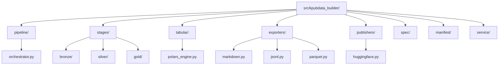

# KPubData Builder — 한국 공공데이터 빌더

[](https://www.python.org/)
[](https://github.com/yeongseon/kpubdata-builder/blob/main/LICENSE)

**KPubData Builder (Korea Public Data Builder)**는 [`kpubdata`](https://github.com/yeongseon/kpubdata)가 수집한 한국 공공데이터를 다양한 형식의 결과물로 만들어주는 데이터셋 빌드 파이프라인입니다.

---

## 소개

KPubData Builder는 `kpubdata` 사서가 가져온 원시 데이터를 사용자가 읽기 좋은 **책(보고서)이나 데이터셋 묶음으로 만들어주는 출판사**와 같습니다.

데이터를 수집하고, 검증하고, 원하는 형식으로 예쁘게 포장하는 전체 과정을 담당합니다. 최종 결과물은 다음과 같은 형태로 만들어집니다:

- [Markdown](https://ko.wikipedia.org/wiki/%EB%A7%88%ED%81%AC%EB%8B%A4%EC%9A%B4) 형식의 데이터셋 및 보고서
- [Hugging Face](https://huggingface.co/) 데이터셋 레이아웃
- [JSONL](https://jsonlines.org/) / [Parquet](https://parquet.apache.org/) / [CSV](https://ko.wikipedia.org/wiki/CSV) 형식의 데이터 파일
- 데이터셋 카드 및 메타데이터 명세서(Manifest)

## 이 프로젝트가 존재하는 이유

`kpubdata`로 공공데이터를 수집했다면, 그 다음 단계가 필요합니다:

- **형식 변환**: 수집한 원시 데이터를 Markdown, CSV, Parquet 등 목적에 맞는 형식으로 바꿔야 합니다.
- **데이터 검증**: 수집 과정에서 누락되거나 잘못된 데이터가 없는지 자동으로 확인해야 합니다.
- **결과 추적**: 언제, 어떤 데이터를, 어떤 설정으로 빌드했는지 기록(Manifest)을 남겨야 합니다.
- **반복 가능한 과정**: 같은 설정으로 언제든 동일한 결과를 다시 만들 수 있어야 합니다.

KPubData Builder는 이 모든 과정을 하나의 파이프라인(자동화된 처리 흐름)으로 묶어줍니다.

## 핵심 개념

| 용어 | 설명 |
| :--- | :--- |
| **BuildSpec** | 어떤 데이터를 어떻게 수집해서 어디로 보낼지 적힌 기획서 ([YAML](https://ko.wikipedia.org/wiki/YAML) 형식) |
| **Artifact** | 빌드 과정을 통해 만들어진 최종 결과물 (파일 등) |
| **Manifest** | 빌드 결과물에 대한 상세 명세서 (버전, 생성일, 설정값 등의 기록) |
| **Exporter** | 데이터를 특정 형식(Markdown, [JSON](https://ko.wikipedia.org/wiki/JSON), Parquet 등)으로 변환하는 도구 |
| **Publisher** | 완성된 결과물을 특정 장소([GitHub](https://github.com/), [Hugging Face Hub](https://huggingface.co/) 등)에 올리는 도구 |

## 빌드 파이프라인 흐름

Builder는 단순 선형 ETL이 아니라 **Medallion Architecture**(Bronze → Silver → Gold)를 따릅니다. 데이터가 처리되는 전체 과정은 다음과 같습니다:


```text
[BuildSpec 기획서] → [Bronze 원시 수집] → [Silver Polars 표 변환·검증] → [Gold 패키징] → [Export 형식 변환] → [Manifest 결과 기록]
```

1. **BuildSpec**: [YAML](https://ko.wikipedia.org/wiki/YAML)(들여쓰기로 구조를 표현하는 설정 파일) 형태로 "어떤 데이터를 가져와서 어떤 형식으로 내보낼지" 기획합니다.
2. **Bronze**: `kpubdata`를 통해 실제 공공데이터 [API](https://ko.wikipedia.org/wiki/API)에서 원시 데이터를 수집하고 소스 스냅샷·provenance를 남깁니다.
3. **Silver**: Bronze 산출물을 [Polars](https://pola.rs/) 단일 엔진으로 표(table) 형태로 변환하고, 스키마 검증·통계 계산·미리보기를 생성합니다.
4. **Gold**: Silver 결과를 분할·내보내기 준비가 된 패키지로 조립합니다.
5. **Export**: Gold 패키지를 Markdown, JSONL, Parquet, CSV 등 원하는 형식으로 변환합니다.
6. **Manifest**: 빌드 결과에 대한 상세 기록(버전, 생성일, 포함 항목 수 등)을 자동으로 생성합니다.

> Bronze/Silver/Gold 단계는 사용자가 BuildSpec에 직접 입력하는 필드가 아니라, Builder orchestrator가 내부적으로 관리하는 실행 단계입니다.

## 설치 방법

[pip](https://pip.pypa.io/en/stable/)(파이썬 패키지 설치 도구)를 사용하여 설치합니다.

```bash
pip install kpubdata-builder
```

## 빠른 시작

### CLI(명령줄) 사용

터미널에서 빌드 기획서(YAML 파일)를 지정하여 실행합니다:

```bash
# 기획서 기반으로 빌드 실행
kpubdata-builder build spec.yaml

# 기획서 검증만 실행 (실제 빌드 없이 오류 확인)
kpubdata-builder validate spec.yaml
```

### Python API 사용

코드에서 직접 빌드 과정을 제어할 수도 있습니다:

```python
from pathlib import Path

from kpubdata_builder.service import BuilderService

# BuilderService 구성 (client_factory는 kpubdata Client를 반환)
service = BuilderService(
    output_root=Path("./build"),
    client_factory=lambda: my_kpubdata_client,
)

# YAML 기획서 문자열로 빌드 실행
result = service.build(Path("spec.yaml").read_text(encoding="utf-8"))

# 결과 확인: build()는 ServiceResponse(status_code, body)를 반환한다
print(result.status_code)          # 예: 200(성공) / 502(소스 fetch 실패)
print(result.body["run_id"])       # 실행 식별자
print(result.body["manifest"])     # 생성된 manifest.json 경로
print(result.body["outcomes"])     # 소스별 단계(bronze/silver/gold) 결과
```

### 빌드 기획서 예시 (spec.yaml)

```yaml
# 어떤 데이터를 가져올지 (sources는 복수 리스트)
dataset_id: weather-village-forecast
title: "동네예보 데이터셋"
description: "기상청 동네예보 서비스에서 수집한 기상 예보 데이터"

sources:
  - provider: datago
    dataset: village_fcst
    params:
      base_date: "20250401"
      nx: 55
      ny: 127

# 어떤 형식으로 내보낼지 (export는 kind로 형식을 지정)
exports:
  - kind: markdown
    output_path: artifacts/weather_report.md
  - kind: jsonl
    output_path: out/weather.jsonl
```

## 지원 내보내기 형식

| 형식 | 설명 | 용도 |
| :--- | :--- | :--- |
| **Markdown** | 사람이 읽기 좋은 텍스트 형식 | 보고서, 문서화 |
| **CSV** | 쉼표로 구분된 표 형식 ([엑셀 호환](https://ko.wikipedia.org/wiki/CSV)) | 스프레드시트 분석 |
| **JSONL** | 한 줄에 하나의 [JSON](https://ko.wikipedia.org/wiki/JSON) 객체 | 대용량 데이터 처리 |
| **Parquet** | 열 기반 압축 형식 ([Apache Parquet](https://parquet.apache.org/)) | 빅데이터 분석, ML 학습 |
| **Hugging Face** | [HF Datasets](https://huggingface.co/docs/datasets) 호환 레이아웃 | AI/ML 모델 학습 데이터 |

## 파일 구조 가이드



```text
src/kpubdata_builder/
├── pipeline/        # 메달리온 단계 흐름 제어 (orchestrator)
├── stages/          # bronze/silver/gold 단계 구현
├── tabular/         # Polars 기반 표 처리 엔진
├── exporters/       # 데이터 형식 변환 (Markdown, JSONL 등)
├── publishers/      # 결과물 업로드 (Hugging Face, Kaggle 등)
├── spec/            # 빌드 기획서(BuildSpec) 모델·검증
├── manifest/        # 빌드 명세서 생성 로직
└── service/         # BuilderService 및 HTTP 서비스 진입점
```

---

## 문서 가이드

### 핵심 설계
- [아키텍처](ARCHITECTURE.md): 시스템 아키텍처 및 레이어 설계
- [도메인 모델](DOMAIN_MODEL.md): 핵심 도메인 모델(BuildSpec, Artifact 등) 정의
- [내보내기 모델](EXPORT_MODEL.md): 데이터 변환 및 Exporter 구현 모델
- [API 규약](API_CONTRACT.md): CLI 및 파이썬 인터페이스 규약

### 개발 가이드
- [에이전트 가이드](AGENTS.md): AI 에이전트를 위한 개발 규칙 및 가이드
- [기여 방법](CONTRIBUTING.md): 프로젝트 기여 방법 및 개발 환경 설정

### 프로젝트 관리
- [요구사항 (PRD)](PRD.md): 제품 요구사항 및 목표 정의
- [로드맵](ROADMAP.md): 향후 개발 계획 및 마일스톤
- [작업 계획](PLAN.md): 초기 구축 및 작업 계획

### 자세한 참고
- [ADR: 오케스트레이터로서의 Builder](adrs/0001-builder-as-orchestrator.md): 빌더 아키텍처 결정 기록
- [에러 처리](guides/error-handling.md): 예외 계층 및 오류 응답 정책
- [제품군 전체 아키텍처](https://github.com/yeongseon/kpubdata/blob/main/docs/product-family-architecture.md): **KPubData 3개 저장소의 전체 시스템 아키텍처**

---

## KPubData Product Family

| 패키지 | 역할 |
| :--- | :--- |
| [kpubdata](https://github.com/yeongseon/kpubdata) | 한국 공공데이터 접근 + 파싱 + 정규화 코어 |
| [kpubdata-builder](https://github.com/yeongseon/kpubdata-builder) | 데이터셋 조립 + 내보내기 파이프라인 |
| [kpubdata-studio](https://github.com/yeongseon/kpubdata-studio) | 빌드 작성 및 실행을 위한 시각적 인터페이스 |

---

## 관련 문서

### 이 저장소 내 문서
| 문서 | 설명 |
| :--- | :--- |
| [아키텍처](ARCHITECTURE.md) | 시스템 아키텍처 설계 |
| [도메인 모델](DOMAIN_MODEL.md) | 도메인 모델 정의 |
| [내보내기 모델](EXPORT_MODEL.md) | 데이터 변환 모델 |
| [API 규약](API_CONTRACT.md) | API 인터페이스 규약 |
| [에이전트 가이드](AGENTS.md) | 에이전트 개발 가이드 |
| [기여 방법](CONTRIBUTING.md) | 프로젝트 기여 가이드 |
| [요구사항 (PRD)](PRD.md) | 제품 요구사항 정의서 |
| [로드맵](ROADMAP.md) | 프로젝트 로드맵 |
| [작업 계획](PLAN.md) | 작업 실행 계획 |
| [에러 처리](guides/error-handling.md) | 오류 처리 가이드 |
| [변경 이력](CHANGELOG.md) | 프로젝트 변경 이력 |

### KPubData Product Family
| 저장소 | 문서 | 설명 |
| :--- | :--- | :--- |
| [kpubdata](https://github.com/yeongseon/kpubdata) | [ARCHITECTURE.md](https://github.com/yeongseon/kpubdata/blob/main/ARCHITECTURE.md) | Core 아키텍처 |
| [kpubdata-studio](https://github.com/yeongseon/kpubdata-studio) | [ARCHITECTURE.md](https://github.com/yeongseon/kpubdata-studio/blob/main/ARCHITECTURE.md) | Studio 아키텍처 |

---

## 초기 배포 목표

### v0.1
- BuildSpec 모델 및 검증 로직 구현
- `kpubdata`를 사용한 데이터 수집 실행기(Executor) 구현
- [Markdown](https://ko.wikipedia.org/wiki/%EB%A7%88%ED%81%AC%EB%8B%A4%EC%9A%B4) 내보내기 기능
- Manifest(빌드 기록) 자동 생성
- 테스트 및 타입 검사 환경 구축

### v0.2
- [JSONL](https://jsonlines.org/) / [Parquet](https://parquet.apache.org/) 내보내기 기능 추가
- [Hugging Face](https://huggingface.co/docs/datasets) 데이터셋 레이아웃 지원
- 빌드 기획서 템플릿 제공

### v0.3
- 게시(Publish) 훅을 통한 자동 업로드 기능
- 빌드 이력 관리 및 비교 기능
- CI/CD 파이프라인 연동 지원
